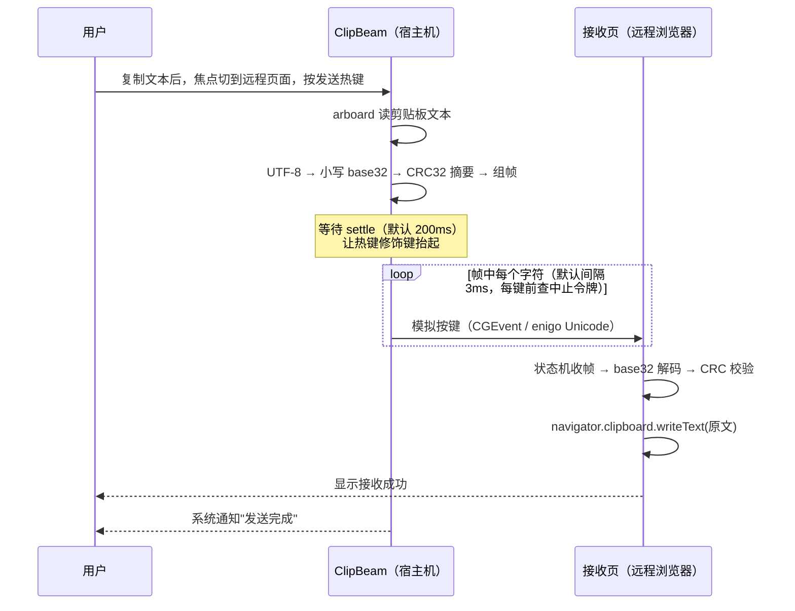
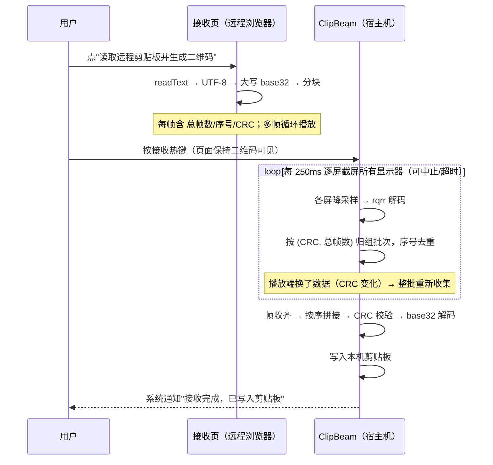
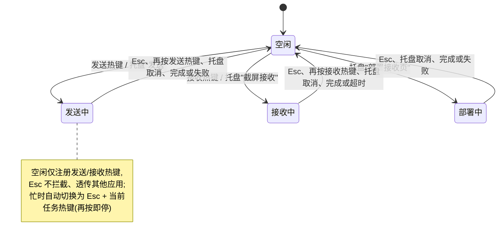

# ClipBeam

宿主机 ↔ 无网络远程环境之间的**剪贴板桥接工具**。

典型场景：通过 VDI / 远程桌面 / 云桌面浏览器访问一台与外网隔离的机器，
无法使用剪贴板同步、无法传输文件。ClipBeam 利用两条"天然存在"的通道：

- **键盘通道**（宿主机 → 远程）：本机模拟逐字符按键，远程网页接收；
- **光通道**（远程 → 宿主机）：远程网页循环播放二维码，本机截屏解码。

远程侧只需要一个**单文件、零依赖、可断网 `file://` 打开**的网页
（`packages/client-vanilla/dist/index.html`，由 `packages/client-vanilla`
构建生成，`pnpm build:web` 即可产出），无需安装任何软件。

---

## 目录

- [工作原理](#工作原理)
- [快速开始](#快速开始)
- [使用方法](#使用方法)
- [脚本引擎（JS/TS）](#脚本引擎jsts)
- [配置与设置](#配置与设置)
- [命令行子命令](#命令行子命令)
- [构建](#构建)
- [测试](#测试)
- [协议规范](#协议规范)
- [限制与注意事项](#限制与注意事项)

---

## 工作原理

```mermaid
flowchart LR
    subgraph HOST["宿主机（Rust 托盘程序）"]
        CB1["本机剪贴板"]
        KB["键盘模拟<br/>macOS: CGEvent<br/>Windows: enigo"]
        CAP["截屏 + 二维码解码<br/>xcap + rqrr"]
        CB2["写入本机剪贴板"]
    end

    subgraph REMOTE["远程（单文件网页，浏览器打开）"]
        PAGE_IN["键盘接收状态机<br/>base32 + CRC32 校验"]
        RCB1["navigator.clipboard<br/>.writeText()"]
        RCB2["navigator.clipboard<br/>.readText()"]
        QR["分帧 + 循环播放二维码<br/>（内联 qrcode 库）"]
    end

    CB1 -->|"① 读文本"| KB
    KB -->|"② 逐键输入帧（协议 A）"| PAGE_IN
    PAGE_IN -->|"③ 校验通过"| RCB1

    RCB2 -->|"④ 读文本"| QR
    QR -->|"⑤ 循环显示二维码（协议 B）"| CAP
    CAP -->|"⑥ 轮询截屏、按批次组包、校验"| CB2
```

三条协议：

| 通道 | 方向 | 介质 | 帧格式 |
|---|---|---|---|
| **A** | 宿主机 → 远程 | 键盘逐字符 | `0clipbeam{ver}0<小写base32>0<7字符CRC摘要>1`（`ver=1` 未压缩 / `ver=2` zstd 压缩） |
| **B** | 远程 → 宿主机 | 二维码截屏 | `CB1.总帧数.序号.7字符CRC摘要.大写base32块` |
| **C** | 宿主机 → 远程 | 键盘（一次性引导） | 全 ASCII 单行「自解压 HTML」，打开后还原完整接收页 |

两条数据通道统一使用：

- **base32（RFC4648 无填充）**：通道 A 用小写，帧分隔符只用数字行的 `0`/`1`，
  全程不产生 Shift 组合键，任何键盘布局都能敲出；通道 B 用大写（属于 QR
  alphanumeric 字符集，单码容量更大）；
- **CRC32（IEEE，多项式 `0xEDB88320`）**：对**拼包后的 base32 字符串**计算，
  摘要取 4 字节大端再 base32（7 字符）。Rust 与 JS 各有一份表驱动实现，互为校验。

### 宿主机 → 远程（协议 A）时序



### 远程 → 宿主机（协议 B）时序



### 任务忙闲与热键状态



---

## 快速开始

### 1. 构建并启动

```bash
# macOS（推荐）：打包成可双击的 ClipBeam.app
scripts/package-macos.sh --install     # 安装到 /Applications，Spotlight 搜 ClipBeam 启动

# 或直接运行裸二进制（联调用，会带一个终端窗口）
cargo build --release
./target/release/clipbeam          # 无参数 = 常驻系统托盘（macOS 平时不显示 Dock 图标）
```

### 2. 授予权限（仅 macOS）

首次使用时系统会弹窗授权，在 **系统设置 → 隐私与安全性** 中确认：

| 权限 | 用途 |
|---|---|
| 辅助功能 | 模拟键盘输入（发送、部署） |
| 屏幕录制 | 截屏解码二维码（接收） |
| 通知 | 任务完成/失败提示 |

授权后需重启程序生效。

### 3. 把接收页弄到远程（三选一）

1. **键盘部署（无任何通道时）**：远程打开记事本并聚焦 → 托盘菜单选
   **「部署接收页到远程（键盘输入，约 3 分钟）」** → 等待逐字符敲完 →
   把记事本内容另存为 `clipbeam.html`（UTF-8 编码）→ 浏览器打开；
2. **剪贴板部署（远程桌面自带剪贴板同步时）**：托盘选
   **「部署接收页（复制到宿主机剪贴板）」** → 在远程粘贴保存为 `.html`；
3. 执行 `pnpm build:web` 构建接收页，把产物
   `packages/client-vanilla/dist/index.html` 通过任意可用方式传过去。

### 4. 双向使用

接收页在远程浏览器打开后（断网亦可，`file://` 直接打开）：

- **宿主机 → 远程**：本机复制文本 → 鼠标点一下远程页面使其获得焦点 →
  按 `Cmd+Shift+K`（Windows 为 `Ctrl+Shift+K`）；
- **远程 → 宿主机**：远程页面点 **「读取远程剪贴板并生成二维码」** →
  二维码开始循环播放 → 宿主机按 `Cmd+Shift+J`。

---

## 使用方法

### 发送（宿主机 → 远程）

1. 在宿主机复制任意文本（限纯文本，默认上限 256 KB）；
2. 把焦点切到远程浏览器的 ClipBeam 页面（点击页面任意位置）；
3. 按发送热键，或托盘菜单选「发送本机剪贴板 → 远程」；
4. 程序等待 200ms 让修饰键抬起，然后逐键敲入协议帧，页面收到后自动：
   校验 CRC → base32 解码 → 写入远程剪贴板 → 页面提示成功。

> 页面上的「暂停接收」复选框：当你需要在页面输入框里打字时勾选，
> 避免键盘状态机误收普通击键。

**紧急中止**：发送是逐键模拟，若发现焦点不对、按键触发了异常操作，立即：

- 按 **Esc**（中止热键，默认）；
- 或**再按一次发送热键**；
- 或托盘菜单选「取消」。

每敲一个字符前都会检查中止令牌，最坏停止延迟约等于一个键间隔（默认 3ms）。

### 接收（远程 → 宿主机）

1. 在远程页面「② 发送出站」区点 **「读取远程剪贴板并生成二维码」**；
   - 若浏览器拒绝 `navigator.clipboard.readText()`（权限策略限制），
     把文本粘贴到出现的文本框，点「用上方文本生成二维码」；
   - 「高级」可调整每帧字符数（默认 800）与每帧停留时长（默认 300ms）；
2. 二维码以全屏遮罩**固定居中循环播放**（页面滚动/缩放都不影响截屏区域），
   浮层上实时显示当前帧/总帧数；**点击浮层任意处即关闭并停止播放**
   （也可使用页面上的「■ 停止播放」按钮）；
3. 宿主机按接收热键（`Cmd+Shift+J`）或托盘选「截屏接收远程二维码」；
4. 程序每 250ms 对**所有显示器**逐屏截屏解码（多显示器无需指定屏幕，
   运行中热插拔也能自动适配），按 `(CRC, 总帧数)` 批次自动去重组包；
   播放中途换了一批数据会自动整批重来；
5. 收齐且 CRC 校验通过后写入本机剪贴板并弹通知；默认 120 秒超时。

中止方式同样有三种：**Esc**、再按一次接收热键、托盘取消。

> **进度窗口**：发送/接收/部署任务启动时会自动弹出独立进度窗口，显示进度条、
> 速度、已用时间与预计剩余时间；任务结束 3 秒后自动隐藏。

### 托盘菜单

| 菜单项 | 说明 |
|---|---|
| 状态 | 当前空闲/忙（不可点击；进度显示在独立进度窗口） |
| 发送本机剪贴板 → 远程 | 触发一次协议 A 发送 |
| 截屏接收远程二维码 | 触发一次协议 B 接收 |
| 部署接收页到远程（键盘输入，约 3 分钟） | 协议 C，逐键敲自解压引导页 |
| 部署接收页（复制到宿主机剪贴板） | 协议 C，走远程桌面自带剪贴板 |
| 脚本编辑器… | 打开独立的脚本大窗口（编辑 + 运行 + Console 面板） |
| 设置… | 打开设置窗口 |
| 退出 ClipBeam | 退出常驻程序 |

任务运行期间，三个执行类菜单项自动禁用。

---

## 脚本引擎（JS/TS）

除了「发送本机剪贴板」这类固定动作，ClipBeam 还内置了一个**嵌入式脚本引擎**：
用 JavaScript / TypeScript 编排整个流程（读文件 → 计算摘要 → 压缩分片 → 逐键输出），
适合「把某个文件的多个分片依次敲进远程窗口」这类固定脚本化场景。

```js
const $ = Clipbeam
const bytes = await $.file('data.bin')   // 读真实文件（相对路径按进程工作目录解析）
const chunks = $.zstd(bytes, 1024)       // Zstandard 压缩并按 1 KiB 切片
$.typeStr(`共 ${chunks.length} 片\n`, 10) // 逐键打进当前焦点窗口
for (let i = 0; i < chunks.length; i++) {
  if (await $.confirm(`发送第 ${i} 片？`)) {
    await $.sleep(1000)
    $.typeStr(`${i}\n${$.base32(chunks[i])}\n`, 10)
  }
}
```

### 三层结构

| 层 | 位置 | 职责 |
|---|---|---|
| 引擎（core） | `crates/clipbeam-script/` | 跑 JS/TS（QuickJS + oxc 进程内转译）、基础能力（`$.file` / `$.sleep` / `console` / `TextDecoder` / `TextEncoder`）、**能力扩展机制** |
| 使用方能力集 | `crates/clipbeam-scripting/` | 用扩展机制注入 ClipBeam 需要的能力：`md5` / `base32` / `zstd` / `typeStr` / `confirm`；脚本目录与内置示例；终端宿主 |
| 应用 | `src-tauri/`（`scripting.rs` / `standby.rs` / `console_panel.rs` / `script_runner.rs`） | 接 Tauri 命令、Worker 任务、`Typer` 键盘输出、**系统原生确认框**、**惰性待命窗口**、**Console 面板缓冲** |

引擎本身**不认识**剪贴板 / 键盘 / Zstandard：需要什么能力由使用方通过
`ScriptExtension` 注入（新增能力只要实现 `register` + `spec` 两个方法）。

### 能力一览

| 能力 | 说明 |
|---|---|
| `$.file(path)` | 读真实文件，返回 `Promise<ArrayBuffer>`；相对路径按**进程工作目录**解析 |
| `$.sleep(ms)` | 异步等待；被中止时立即返回 |
| `$.md5(data)` | 32 位小写十六进制 MD5 |
| `$.base32(data)` | RFC4648 Base32（无填充、小写） |
| `$.zstd(data, chunkSize?)` | Zstandard 压缩（级别 3）并按 `chunkSize` 切片，默认 1024 字节 |
| `$.typeStr(text, delayMs?)` | 把文本交给宿主输出：GUI 下逐个字符打进**当前焦点窗口**，命令行下打印到终端 |
| `$.confirm(message)` | 向用户提问：GUI 下弹**系统原生**确认框（是 / 否 / 取消），命令行下读 stdin；回答「是」为 `true`、「否」为 `false`、取消/中止时抛异常，**不设超时**（一直等用户回答） |
| `console.log/info/debug/warn/error` | 写到脚本窗口底部的 **Console 面板**（按等级着色）；命令行运行时打到终端 |
| `TextDecoder` / `TextEncoder` | 支持全部 WHATWG 编码标签（`utf-8` / `gbk` / `gb18030` / `big5` / `shift_jis` …） |

脚本里可以直接使用**顶层 `await`**，不需要包 `async` IIFE。

### 运行方式

**GUI**：托盘菜单「脚本编辑器…」，或主窗口侧边栏 / 仪表盘的「脚本」按钮
→ 打开**独立的脚本大窗口**（1100×760，可缩放；左侧是脚本列表，右侧是编辑器 + Console）
→ 选/新建脚本 → 点「运行」。

脚本是一个独立窗口而不是主窗口里的一个页面，原因有三：编辑器需要足够的空间；
它可以和主窗口/进度窗口并排摆放；关闭主窗口（托盘模式）后脚本窗口仍可独立使用。

> **Dock 图标**：平时不占 Dock（托盘常驻），但**脚本窗口可见期间会显示 Dock 图标**，
> 这样你可以把编辑器丢到另一块屏幕、用 Cmd+Tab 切回它；脚本窗口一关，Dock 图标随之消失。
> 实现见 `src-tauri/src/lib.rs` 的 `sync_dock_icon`（用 Tauri 的 `set_dock_visibility`，
> 它内部对 macOS 的进程类型切换做了防抖）。

**待命窗口只在首次 `$.typeStr` 之前弹**：脚本不一定注入键盘事件（例如只读文件、算摘要的脚本），
所以待命窗口是惰性的 ——

* 脚本执行到**第一次** `$.typeStr` 时，才弹出待命窗口并等用户点击目标窗口；
* 纯计算脚本（从不输出）**不会有任何待命提示**，直接跑完；
* 同一次运行里只提示一次，后续 `$.typeStr` 不再重复打扰；
* 脚本在那之前可能已经读文件、算摘要、打印 `console` 日志 —— 这些都照常执行。

待命窗口有 10 秒倒计时，超时即取消任务。进度窗口会显示「已敲入 N/M 字符 + 当前输出片段」，
按 **Esc**（或点「中止」）随时停下。

**命令行**：`clipbeam script <文件>`，`$.typeStr` 写终端、`$.confirm` 读 stdin
（不需要待命窗口：终端的焦点就是当前窗口）；加 `--raw` 时不走逐字打字节奏，
适合把输出重定向到文件或管道。

### 脚本目录

```
macOS   ~/Library/Application Support/ClipBeam/scripts/
Windows %APPDATA%\ClipBeam\scripts\
Linux   ~/.config/ClipBeam/scripts/
```

首次启动会写入两个内置示例（`01-quick-start.js`、`02-ts-demo.ts`），**已存在的文件不会被覆盖** ——
你可以放心修改示例，下次启动不会还原。GUI 里可以新建 / 编辑 / 保存 / 删除。
`$.file` 不受脚本目录限制，可以读任意路径（相对路径按进程工作目录解析）。

### Console 面板

脚本窗口底部是 Console 面板，脚本里的 `console.log/info/debug/warn/error` 会出现在这里
（GUI 不写标准输出——用户看不到；只有命令行运行时才打到终端）：

* 按等级着色（error 红、warn 琥珀、debug 灰），每行带时间；
* 面板里还有运行状态行：`▶ 运行 xxx`、`✓ 完成(输出 N 个字符,用时 Xms)`，
  脚本报错时把引擎的错误原文（含文件名与行列）写成 error 行，中止时写 warn 行；
* 每次运行前清空 —— 面板永远只属于**这一次**运行，排查时不会被上一轮输出干扰；
* 上限 1000 行（狂打印也只保留最后 1000 行），可折叠、可按等级过滤、可手动清空；
* 日志存在后端，关闭再打开脚本窗口时面板会自动恢复。

### 脚本窗口里的确认框

脚本窗口有三处需要用户确认的危险操作（切换脚本 / 新建 / 删除会丢改动），以及「有未保存修改时
是否先保存再运行」。它们统一走 `@tauri-apps/plugin-dialog` 的 `ask()`，也就是**系统原生 Yes/No 弹框**
—— 与脚本里 `$.confirm` 的观感一致。

> 注意：这里不能用 `window.confirm()`。Tauri 的 webview 会把它接管成插件调用，
> 而权限里只放开了消息类弹框，直接调用会抛 `dialog.confirm not allowed. Command not found`。
> 另外 `dialog:default` 只包含 open/save/message，**不含**消息弹框，必须在
> `src-tauri/capabilities/default.json` 里显式写 `dialog:allow-ask`（或 `allow-message`）。

### 编辑器能力

脚本窗口里的编辑器用 CodeMirror 6，提供：

- JS/TS 语法高亮、括号匹配、自动缩进、搜索；
- `$.` / `Clipbeam.` **补全**（数据来自后端能力清单，与运行期注册的能力同源）；
- **TypeScript 真类型诊断**：用 TypeScript 编译器 API 检查脚本，
  类型不匹配、拼错方法名、用了运行时不存在的 API 都会在编辑器里标红/标黄；
- `Cmd/Ctrl+Enter` 运行、`Cmd/Ctrl+S` 保存。

编辑器里的类型提示来自两个声明文件（`crates/*/src/spec/clipbeam.d.ts`），
它们同时被 `pnpm typecheck:scripts` 使用，因此**编辑器里的断言与命令行检查一致**：

```bash
pnpm typecheck:scripts    # 用 tsc 检查 scripts/*.ts（不需要装 Node 也能运行脚本本身）
```

### TypeScript 支持范围

`.ts` / `.mts` / `.cts` 会被自动转译（oxc，进程内，**不需要 Node/tsc**）：

| 支持 | 说明 |
|---|---|
| 类型注解 / `interface` / `type` / `as` / 泛型 | 直接剥掉 |
| `enum` / `namespace` | 转成运行时对象 |
| 顶层 `await` | 脚本按 module 解析，因此允许 |
| 现代 JS 语法 | 原样保留，不做 ES 降级 |

| 不支持 | 说明 |
|---|---|
| JSX / TSX | 没有 React 运行时，`.tsx` 会明确报错 |
| 装饰器等需要 helper 的语法 | 明确报错，而不是生成跑不起来的代码 |
| ESM 的 `import` / `export` 值导入 | 运行时是「全局 + async eval」，`import type` 会被移除，值导入暂不支持 |
| source map | 运行期报错的**行列号指向转译后的 JS**；语法错误不受影响（诊断直接给 `.ts` 的位置） |

### 安全说明

脚本拥有**与 ClipBeam 同等的本机权限**：`$.file` 可以读任意文件、`$.typeStr` 会把内容
敲进当前焦点窗口。当前没有沙箱、没有权限提示，请只运行你信任的脚本。

---

## 配置与设置

托盘菜单「设置…」打开图形设置窗口，所有项实时校验，非法时「保存」禁用：

| 设置项 | 默认值（macOS / Windows） | 合法范围 |
|---|---|---|
| 发送热键 | `Cmd+Shift+K` / `Ctrl+Shift+K` | global-hotkey 语法，如 `Cmd+Shift+K`、`Esc` |
| 接收热键 | `Cmd+Shift+J` / `Ctrl+Shift+J` | 同上 |
| 中止热键 | `Esc` | 同上，三个热键不得重复 |
| 键延迟 | 3 ms/键 | 0–100 ms |
| settle 等待 | 200 ms | 0–5000 ms（热键后等修饰键抬起再开始打字） |
| 接收超时 | 120 秒 | 5–3600 秒 |
| 文本上限 | 256 KB | 1–10240 KB |
| zstd 压缩 | 开 | 开/关（仅协议 A，关闭后用未压缩帧便于对比耗时） |

热键支持点击「捕获」后直接按下组合键录入。保存后立即重注册全局热键并通知。

配置文件位置（JSON，可手工编辑；缺字段自动回退默认值）：

- macOS：`~/Library/Application Support/ClipBeam/config.json`
- Windows：`%APPDATA%\ClipBeam\config.json`
- Linux：`~/.config/ClipBeam/config.json`

---

## 命令行子命令

不带参数启动为托盘常驻模式；以下子命令主要用于联调/脚本化：

```bash
clipbeam send-once      # 立即发送一次本机剪贴板（0.2s 后开始，Ctrl-C 强杀）
clipbeam recv-once      # 立即截屏接收，stderr 打印 got/total 进度
clipbeam deploy-type   # 逐键敲入自解压接收页到当前焦点窗口（先切到远程记事本）
clipbeam deploy-copy   # 把自解压接收页复制到宿主机剪贴板
clipbeam script <文件>          # 在终端里运行脚本（.js / .ts，TS 在进程内转译）
clipbeam script <文件> --raw    # 同上，但按整段写出（不逐字模拟打字节奏）
```

---

## 构建

要求 Rust stable（edition 2021）+ Node.js 18+ + pnpm。

pnpm workspace + cargo workspace 单仓多包布局：

- 仓库根：Tauri 主界面（Vue 3 + Vite + TS + shadcn-vue）；`Cargo.toml` 定义 cargo workspace
- `src-tauri/`：Rust crate + Tauri 配置（`clipbeam_lib` + `clipbeam` 二进制）
- `crates/clipbeam-script/`：嵌入式脚本引擎（QuickJS + oxc），只提供基础能力与扩展机制
- `crates/clipbeam-scripting/`：使用方能力集（md5/base32/zstd/typeStr/confirm）+ 脚本目录 + 终端宿主
- `scripts/`：示例脚本（供命令行运行；内置示例的真源在 `crates/clipbeam-scripting/seed/`）
- `packages/shared/`：两个 client 共享的协议逻辑（CB1 分帧、base32/CRC、zstd、剪贴板、接收状态机）
- `packages/client/`：浏览器端 Vue 3 收发页（shadcn-vue + Tailwind v4，开发预览用）
- `packages/client-vanilla/`：零依赖单文件接收页，构建产物被 Rust `include_str!` 内嵌用于部署

```bash
# 安装全部 workspace 依赖（仓库根执行一次即可）
pnpm install

# 单独构建远程接收页（产物 packages/client-vanilla/dist/index.html）
pnpm build:web

# Debug 开发模式（Tauri 自动启动 Vite dev server + Rust 编译 + 托盘应用；
# cargo 构建时会按需自动构建 client-vanilla，可用 CLIPBEAM_SKIP_WEB_BUILD=1 跳过）
cd src-tauri && cargo tauri dev

# Release 打包（Tauri 自动：前端构建 + Rust release + bundle）
cd src-tauri && cargo tauri build
```

### macOS：打包成可双击的 .app（推荐）

直接双击裸二进制会打开一个终端窗口，关掉终端程序即退出。用打包脚本生成
标准应用包，启动无终端、平时不占 Dock（仅菜单栏图标；脚本窗口打开期间会临时出现在 Dock），
与普通 Mac 应用一致：

```bash
scripts/package-macos.sh              # 生成 src-tauri/target/release/bundle/macos/ClipBeam.app
scripts/package-macos.sh --install    # 额外安装到 /Applications（Spotlight/Launchpad 可启动）
```

脚本自动完成：`pnpm install`（如需）→ `cargo tauri build`（Tauri 2 接管前端
构建、Rust release 编译、`Contents/` 与 `Info.plist` 组装、`.icns` 生成）→
ad-hoc 代码签名 → LaunchServices 注册。之后在 Finder 双击或 `open ClipBeam.app`
即可启动，程序由 launchd 托管，关闭终端/SSH 断开都不影响运行。

> 首次启动需在「系统设置 → 隐私与安全性」授予辅助功能、屏幕录制、通知权限；
> ad-hoc 签名的应用与之前裸二进制是不同身份，权限需要重新授权一次。

平台依赖：

- **macOS**：Xcode Command Line Tools；键盘模拟走 CoreGraphics
  （`CGEventKeyboardSetUnicodeString`，任意线程可用），通知走 Notification Center；
- **Windows**：MSVC 工具链；键盘模拟走 enigo，通知走 Toast（winrt-notification）。

已验证 Windows 目标交叉编译检查：

```bash
rustup target add x86_64-pc-windows-msvc
cd src-tauri && cargo check --target x86_64-pc-windows-msvc
```

托盘图标由 [src-tauri/build.rs](src-tauri/build.rs) 在编译期代码生成（Bresenham K 字
光束 + 青色光点），无需额外二进制资源入库。

---

## 测试

```bash
# 整个 workspace（引擎、能力集、Tauri 应用）
cargo test --workspace

# 新增的两个 crate 是 clippy 干净的；src-tauri / build.rs 里有一批历史告警，
# 所以这里只对它们跑 clippy（要做全量门禁需先清掉历史告警）
cargo clippy -p clipbeam-script -p clipbeam-scripting --all-targets

# 只跑脚本引擎与能力集（第一次编译 QuickJS 的 C 代码较慢，之后很快）
cargo test -p clipbeam-script
cargo test -p clipbeam-scripting

# Tauri 侧的协议层单元测试与跨实现 E2E
cd src-tauri
cargo test
cargo run --example qr_e2e   # JS(qrcode-generator) 产出帧 → Rust(rqrr) 解码的跨实现 E2E

# 前端：构建 + 脚本类型检查
pnpm build
pnpm typecheck:scripts
pnpm lint
```

> `cargo test -p clipbeam-script` 覆盖：`$.file` / `$.sleep` / 取消、`TextDecoder` 的
> GBK/BOM/fatal、扩展机制的注册/重名/声明一致性、TS 转译与端到端；
> `cargo test -p clipbeam-scripting` 覆盖：md5/base32/zstd 与 Rust 侧独立实现对齐、
> `typeStr`/`confirm` 的宿主语义、脚本目录与内置示例。

---

## 协议规范

### 协议 A：键盘帧

```
0 clipbeam{ver} 0 <payload> 0 <digest> 1
```

- `clipbeam` 为 8 字符公共前缀，第 9 字符 `ver` 为协议版本：
  - `1` = v1，未压缩；
  - `2` = v2，payload 为 zstd 压缩后的 base32（压缩等级 3；压缩后反而更大时自动回退 v1）；
- `0` 为字段分隔、末尾 `1` 为整帧结束，均为数字行键，无需 Shift；
- `payload`：v1 = 文本 UTF-8 字节的小写无填充 base32；v2 = zstd 压缩流的小写 base32；
- `digest`：`CRC32(payload 字节)` 的 4 字节大端再小写 base32（7 字符）；
- 接收页先匹配 `clipbeam` 8 字符前缀再取版本号，同时兼容 v1/v2；
  v2 帧在 base32 解码后调用内联 fzstd 库解压；半截帧 10 秒无后续自动复位。

### 协议 B：二维码帧

```
CB1.<total>.<index>.<digest>.<data>
```

- `total`：本批总帧数（≥1）；`index`：当前帧序号（0 起，`< total`）；
- `digest`：**全部帧 data 按序拼接后**的 CRC32，4 字节大端再大写 base32（7 字符）；
- `data`：文本 UTF-8 → 大写无填充 base32 → 等长分块（默认每块 800 字符）；
- 接收端以 `(digest, total)` 标识批次，序号去重；批次键变化即清空重来；
  收齐后拼接 → 先校验 CRC（不解码先校验）→ base32 解码 → 写剪贴板。

### 协议 C：自解压引导页

- 模板为全 ASCII、单行 HTML/JS，载荷仅 `[A-Z2-7]`，可安全放入双引号 JS 字符串；
- 载荷 = 完整接收页 UTF-8 的大写无填充 base32（编译期 `include_str!` 内嵌
  `packages/client-vanilla/dist/index.html`）；
- 远程浏览器打开引导页后，内联脚本做 base32 解码并 `document.write` 替换自身，
  得到与 client-vanilla 构建产物完全一致的接收页。

---

## 限制与注意事项

- **仅支持文本剪贴板**：图片、富文本等非文本内容会被拒绝，请先转成纯文本；
- **键盘通道耗时与长度成正比**：base32 约 1.6 倍膨胀，按默认 3ms/键估算，
  256 KB 文本约需 20 分钟；开启 zstd 压缩（默认）可显著缩短重复/可压缩文本的耗时，
  但对随机短文本无收益（会自动回退未压缩帧）；大数据量优先考虑能否走协议 C 之外的文件通道；
- **焦点必须在远程页面**：发送前程序不切换任何焦点，请先点击远程页面；
- **键盘布局无关性**：协议 A 只使用小写字母与数字行 `0`/`1`，
  不依赖远程当前输入法（中文输入法下仍可正常接收）；
- **浏览器剪贴板权限**：`navigator.clipboard.readText()` 需要用户手势触发
  且受页面权限策略限制，被拒绝时使用页面上的粘贴备选框；
- **二维码可见性**：多屏环境下会截取所有显示器，二维码出现在任意一块屏幕上
  均可被识别，但该区域需完整可见、未被遮挡/最小化，每屏会降采样到 1600px 宽再解码；
- **安全**：两条通道都没有也不需要网络连接；CRC32 只防传输错误，不提供机密性，
  屏幕/键盘内容在本地处理，不上传任何数据；
- **脚本与本机同权限**：`$.file` 能读任意文件、`$.typeStr` 会把内容敲进当前焦点窗口，
  目前没有沙箱与权限确认，只运行可信脚本；
- **`$.confirm` 会一直等**：系统确认框不设超时，弹框期间 Worker 保持忙（其他任务无法启动）。
  此时按 Esc 只会**终止脚本**，系统弹框仍留在屏幕上，需要手动点掉；
- **弹框时主窗口会临时显形**：托盘模式下主窗口是隐藏的，而系统弹框需要应用处于激活状态，
  因此确认期间主窗口会短暂显示并获得焦点，回答后恢复隐藏。

## 技术栈

| 层 | 依赖 |
|---|---|
| 应用框架 | Tauri 2（tray-icon feature）、tauri-plugin-global-shortcut、tauri-plugin-clipboard-manager、tauri-plugin-notification |
| 前端 | Vue 3 + Vite + TypeScript + Tailwind CSS v4 + shadcn-vue（reka-ui）+ Pinia + vue-router |
| 异步运行时 | tokio（worker 任务用 spawn_blocking 执行同步业务调用） |
| 键盘模拟 | CoreGraphics（macOS）、enigo（Windows/Linux） |
| 剪贴板 | arboard |
| 截屏 / 二维码 | xcap、rqrr、image |
| 编码 / 压缩 / 配置 / CLI | data-encoding、zstd（协议 A 压缩）、serde/serde_json、dirs、clap |
| 通知 | mac-notification-sys（macOS）、winrt-notification（Windows） |
| 脚本引擎 | QuickJS（rquickjs 0.14）、TypeScript → JavaScript 转译（oxc 0.150，进程内，不需要 Node） |
| 脚本编辑器 | CodeMirror 6（高亮 + `$` 补全 + TypeScript 编译器 API 做类型诊断） |
| 远程页 | 原生 JS 单文件，内联 qrcode-generator + fzstd（zstd 解压），零运行时依赖（不参与构建） |
