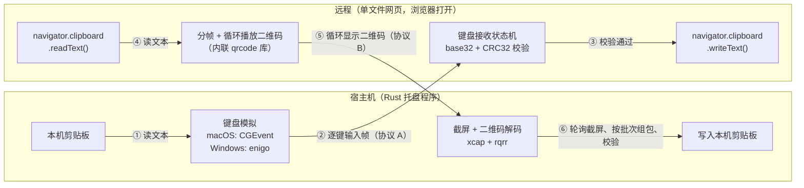
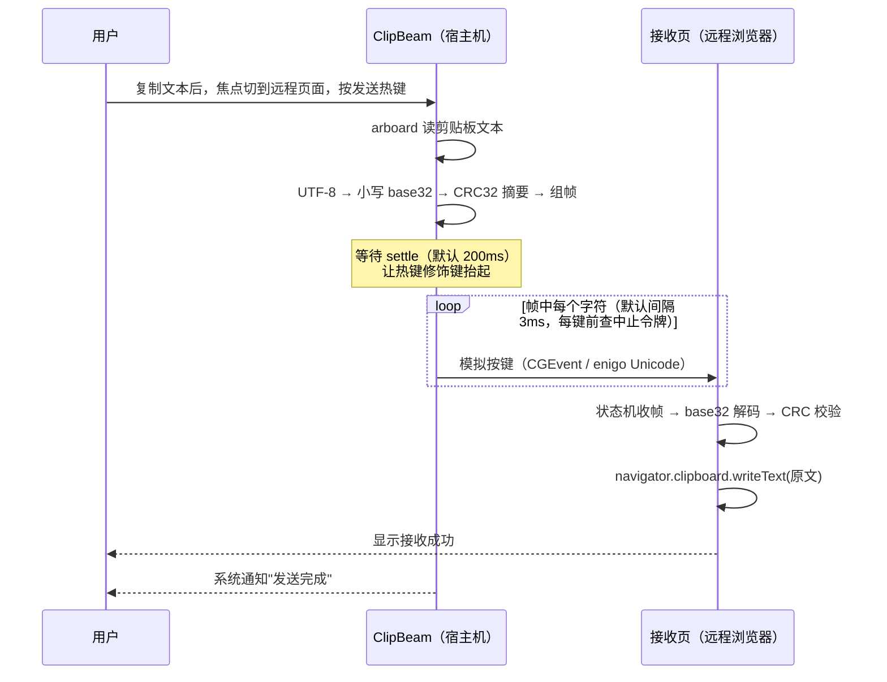
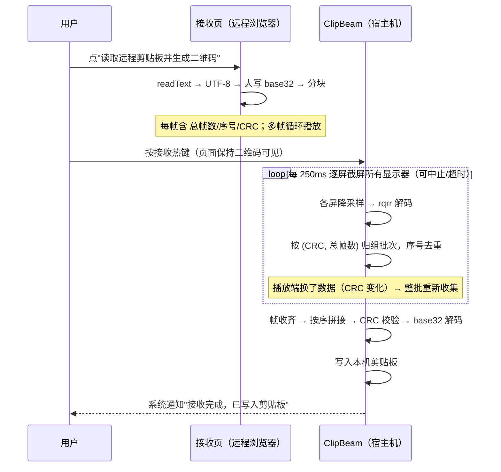
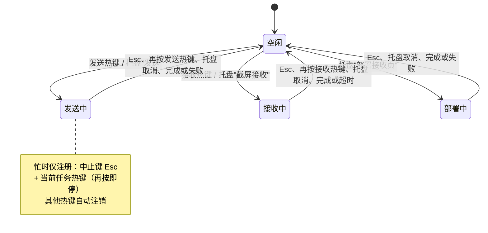

# ClipBeam

宿主机 ↔ 无网络远程环境之间的**剪贴板桥接工具**。

典型场景：通过 VDI / 远程桌面 / 云桌面浏览器访问一台与外网隔离的机器，
无法使用剪贴板同步、无法传输文件。ClipBeam 利用两条"天然存在"的通道：

- **键盘通道**（宿主机 → 远程）：本机模拟逐字符按键，远程网页接收；
- **光通道**（远程 → 宿主机）：远程网页循环播放二维码，本机截屏解码。

远程侧只需要一个**单文件、零依赖、可断网 `file://` 打开**的网页
（[web/clipbeam.html](web/clipbeam.html)），无需安装任何软件。

---

## 目录

- [工作原理](#工作原理)
- [快速开始](#快速开始)
- [使用方法](#使用方法)
- [配置与设置](#配置与设置)
- [命令行子命令](#命令行子命令)
- [构建](#构建)
- [测试](#测试)
- [协议规范](#协议规范)
- [限制与注意事项](#限制与注意事项)

---

## 工作原理



三条协议：

| 通道 | 方向 | 介质 | 帧格式 |
|---|---|---|---|
| **A** | 宿主机 → 远程 | 键盘逐字符 | `0clipbeam10<小写base32>0<7字符CRC摘要>1` |
| **B** | 远程 → 宿主机 | 二维码截屏 | `CB1.总帧数.序号.7字符CRC摘要.大写base32块` |
| **C** | 宿主机 → 远程 | 键盘（一次性引导） | 全 ASCII 单行「自解压 HTML」，打开后还原完整接收页 |

两条数据通道统一使用：

- **base32（RFC4648 无填充）**：通道 A 用小写，帧分隔符只用数字行的 `0`/`1`，
  全程不产生 Shift 组合键，任何键盘布局都能敲出；通道 B 用大写（属于 QR
  alphanumeric 字符集，单码容量更大）；
- **CRC32（IEEE，多项式 `0xEDB88320`）**：对**拼包后的 base32 字符串**计算，
  摘要取 4 字节大端再 base32（7 字符）。Rust 与 JS 各有一份表驱动实现，互为校验。

### 宿主机 → 远程（协议 A）时序



### 远程 → 宿主机（协议 B）时序



### 任务忙闲与热键状态



---

## 快速开始

### 1. 构建并启动

```bash
# macOS（推荐）：打包成可双击的 ClipBeam.app
scripts/package-macos.sh --install     # 安装到 /Applications，Spotlight 搜 ClipBeam 启动

# 或直接运行裸二进制（联调用，会带一个终端窗口）
cargo build --release
./target/release/clipbeam          # 无参数 = 常驻系统托盘（macOS 不显示 Dock 图标）
```

### 2. 授予权限（仅 macOS）

首次使用时系统会弹窗授权，在 **系统设置 → 隐私与安全性** 中确认：

| 权限 | 用途 |
|---|---|
| 辅助功能 | 模拟键盘输入（发送、部署） |
| 屏幕录制 | 截屏解码二维码（接收） |
| 通知 | 任务完成/失败提示 |

授权后需重启程序生效。

### 3. 把接收页弄到远程（三选一）

1. **键盘部署（无任何通道时）**：远程打开记事本并聚焦 → 托盘菜单选
   **「部署接收页到远程（键盘输入，约 3 分钟）」** → 等待逐字符敲完 →
   把记事本内容另存为 `clipbeam.html`（UTF-8 编码）→ 浏览器打开；
2. **剪贴板部署（远程桌面自带剪贴板同步时）**：托盘选
   **「部署接收页（复制到宿主机剪贴板）」** → 在远程粘贴保存为 `.html`；
3. 直接把仓库里的 [web/clipbeam.html](web/clipbeam.html) 通过任意可用方式传过去。

### 4. 双向使用

接收页在远程浏览器打开后（断网亦可，`file://` 直接打开）：

- **宿主机 → 远程**：本机复制文本 → 鼠标点一下远程页面使其获得焦点 →
  按 `Cmd+Shift+K`（Windows 为 `Ctrl+Shift+K`）；
- **远程 → 宿主机**：远程页面点 **「读取远程剪贴板并生成二维码」** →
  二维码开始循环播放 → 宿主机按 `Cmd+Shift+J`。

---

## 使用方法

### 发送（宿主机 → 远程）

1. 在宿主机复制任意文本（限纯文本，默认上限 256 KB）；
2. 把焦点切到远程浏览器的 ClipBeam 页面（点击页面任意位置）；
3. 按发送热键，或托盘菜单选「发送本机剪贴板 → 远程」；
4. 程序等待 200ms 让修饰键抬起，然后逐键敲入协议帧，页面收到后自动：
   校验 CRC → base32 解码 → 写入远程剪贴板 → 页面提示成功。

> 页面上的「暂停接收」复选框：当你需要在页面输入框里打字时勾选，
> 避免键盘状态机误收普通击键。

**紧急中止**：发送是逐键模拟，若发现焦点不对、按键触发了异常操作，立即：

- 按 **Esc**（中止热键，默认）；
- 或**再按一次发送热键**；
- 或托盘菜单选「取消」。

每敲一个字符前都会检查中止令牌，最坏停止延迟约等于一个键间隔（默认 3ms）。

### 接收（远程 → 宿主机）

1. 在远程页面「② 发送出站」区点 **「读取远程剪贴板并生成二维码」**；
   - 若浏览器拒绝 `navigator.clipboard.readText()`（权限策略限制），
     把文本粘贴到出现的文本框，点「用上方文本生成二维码」；
   - 「高级」可调整每帧字符数（默认 800）与每帧停留时长（默认 300ms）；
2. 二维码以全屏遮罩**固定居中循环播放**（页面滚动/缩放都不影响截屏区域），
   浮层上实时显示当前帧/总帧数；**点击浮层任意处即关闭并停止播放**
   （也可使用页面上的「■ 停止播放」按钮）；
3. 宿主机按接收热键（`Cmd+Shift+J`）或托盘选「截屏接收远程二维码」；
4. 程序每 250ms 对**所有显示器**逐屏截屏解码（多显示器无需指定屏幕，
   运行中热插拔也能自动适配），按 `(CRC, 总帧数)` 批次自动去重组包；
   播放中途换了一批数据会自动整批重来；
5. 收齐且 CRC 校验通过后写入本机剪贴板并弹通知；默认 120 秒超时。

中止方式同样有三种：**Esc**、再按一次接收热键、托盘取消。

### 托盘菜单

| 菜单项 | 说明 |
|---|---|
| 状态 | 当前空闲/忙、接收进度 `got/total 帧`（不可点击） |
| 发送本机剪贴板 → 远程 | 触发一次协议 A 发送 |
| 截屏接收远程二维码 | 触发一次协议 B 接收 |
| 部署接收页到远程（键盘输入，约 3 分钟） | 协议 C，逐键敲自解压引导页 |
| 部署接收页（复制到宿主机剪贴板） | 协议 C，走远程桌面自带剪贴板 |
| 设置… | 打开设置窗口 |
| 退出 ClipBeam | 退出常驻程序 |

任务运行期间，三个执行类菜单项自动禁用。

---

## 配置与设置

托盘菜单「设置…」打开图形设置窗口，所有项实时校验，非法时「保存」禁用：

| 设置项 | 默认值（macOS / Windows） | 合法范围 |
|---|---|---|
| 发送热键 | `Cmd+Shift+K` / `Ctrl+Shift+K` | global-hotkey 语法，如 `Cmd+Shift+K`、`Esc` |
| 接收热键 | `Cmd+Shift+J` / `Ctrl+Shift+J` | 同上 |
| 中止热键 | `Esc` | 同上，三个热键不得重复 |
| 键延迟 | 3 ms/键 | 0–100 ms |
| settle 等待 | 200 ms | 0–5000 ms（热键后等修饰键抬起再开始打字） |
| 接收超时 | 120 秒 | 5–3600 秒 |
| 文本上限 | 256 KB | 1–10240 KB |

热键支持点击「捕获」后直接按下组合键录入。保存后立即重注册全局热键并通知。

配置文件位置（JSON，可手工编辑；缺字段自动回退默认值）：

- macOS：`~/Library/Application Support/ClipBeam/config.json`
- Windows：`%APPDATA%\ClipBeam\config.json`
- Linux：`~/.config/ClipBeam/config.json`

---

## 命令行子命令

不带参数启动为托盘常驻模式；以下子命令主要用于联调/脚本化：

```bash
clipbeam send-once      # 立即发送一次本机剪贴板（0.2s 后开始，Ctrl-C 强杀）
clipbeam recv-once      # 立即截屏接收，stderr 打印 got/total 进度
clipbeam deploy-type   # 逐键敲入自解压接收页到当前焦点窗口（先切到远程记事本）
clipbeam deploy-copy   # 把自解压接收页复制到宿主机剪贴板
```

---

## 构建

要求 Rust stable（edition 2021）+ Node.js 18+ + pnpm。

项目布局：`src-tauri/`（Rust crate + Tauri 配置）+ `frontend/`（Vue 3 + Vite + TS + shadcn-vue）。
远程端 `web/clipbeam.html` 是独立单文件，不参与构建。

```bash
# 安装前端依赖
cd frontend && pnpm install && cd ..

# Debug 开发模式（Tauri 自动启动 Vite dev server + Rust 编译 + 托盘应用）
cd src-tauri && cargo tauri dev

# Release 打包（Tauri 自动：前端构建 + Rust release + bundle）
cd src-tauri && cargo tauri build
```

### macOS：打包成可双击的 .app（推荐）

直接双击裸二进制会打开一个终端窗口，关掉终端程序即退出。用打包脚本生成
标准应用包，启动无终端、不占 Dock（仅菜单栏图标），与普通 Mac 应用一致：

```bash
scripts/package-macos.sh              # 生成 src-tauri/target/release/bundle/macos/ClipBeam.app
scripts/package-macos.sh --install    # 额外安装到 /Applications（Spotlight/Launchpad 可启动）
```

脚本自动完成：`pnpm install`（如需）→ `cargo tauri build`（Tauri 2 接管前端
构建、Rust release 编译、`Contents/` 与 `Info.plist` 组装、`.icns` 生成）→
ad-hoc 代码签名 → LaunchServices 注册。之后在 Finder 双击或 `open ClipBeam.app`
即可启动，程序由 launchd 托管，关闭终端/SSH 断开都不影响运行。

> 首次启动需在「系统设置 → 隐私与安全性」授予辅助功能、屏幕录制、通知权限；
> ad-hoc 签名的应用与之前裸二进制是不同身份，权限需要重新授权一次。

平台依赖：

- **macOS**：Xcode Command Line Tools；键盘模拟走 CoreGraphics
  （`CGEventKeyboardSetUnicodeString`，任意线程可用），通知走 Notification Center；
- **Windows**：MSVC 工具链；键盘模拟走 enigo，通知走 Toast（winrt-notification）。

已验证 Windows 目标交叉编译检查：

```bash
rustup target add x86_64-pc-windows-msvc
cd src-tauri && cargo check --target x86_64-pc-windows-msvc
```

托盘图标由 [src-tauri/build.rs](src-tauri/build.rs) 在编译期代码生成（Bresenham K 字
光束 + 青色光点），无需额外二进制资源入库。

---

## 测试

```bash
cd src-tauri
cargo test             # 14 个单元测试：base32/CRC32/帧解析/组包/自解压引导页等
cargo clippy --all-targets
cargo run --example qr_e2e   # JS(qrcode-generator) 产出帧 → Rust(rqrr) 解码的跨实现 E2E
```

---

## 协议规范

### 协议 A：键盘帧

```
0 clipbeam1 0 <payload> 0 <digest> 1
```

- `clipbeam1` 为魔术头（`1` 是协议版本）；
- `0` 为字段分隔、末尾 `1` 为整帧结束，均为数字行键，无需 Shift；
- `payload`：文本 UTF-8 字节的小写无填充 base32；
- `digest`：`CRC32(payload 字节)` 的 4 字节大端再小写 base32（7 字符）；
- 接收页以严格前缀 `0clipbeam10` 识别帧起始（不能用字符集匹配，
  因为魔术头本身含数字 `1`）；半截帧 10 秒无后续自动复位。

### 协议 B：二维码帧

```
CB1.<total>.<index>.<digest>.<data>
```

- `total`：本批总帧数（≥1）；`index`：当前帧序号（0 起，`< total`）；
- `digest`：**全部帧 data 按序拼接后**的 CRC32，4 字节大端再大写 base32（7 字符）；
- `data`：文本 UTF-8 → 大写无填充 base32 → 等长分块（默认每块 800 字符）；
- 接收端以 `(digest, total)` 标识批次，序号去重；批次键变化即清空重来；
  收齐后拼接 → 先校验 CRC（不解码先校验）→ base32 解码 → 写剪贴板。

### 协议 C：自解压引导页

- 模板为全 ASCII、单行 HTML/JS，载荷仅 `[A-Z2-7]`，可安全放入双引号 JS 字符串；
- 载荷 = 完整接收页 UTF-8 的大写无填充 base32（编译期 `include_str!` 内嵌）；
- 远程浏览器打开引导页后，内联脚本做 base32 解码并 `document.write` 替换自身，
  得到与 [web/clipbeam.html](web/clipbeam.html) 完全一致的接收页。

---

## 限制与注意事项

- **仅支持文本剪贴板**：图片、富文本等非文本内容会被拒绝，请先转成纯文本；
- **键盘通道耗时与长度成正比**：base32 约 1.6 倍膨胀，按默认 3ms/键估算，
  256 KB 文本约需 20 分钟；大数据量优先考虑能否走协议 C 之外的文件通道；
- **焦点必须在远程页面**：发送前程序不切换任何焦点，请先点击远程页面；
- **键盘布局无关性**：协议 A 只使用小写字母与数字行 `0`/`1`，
  不依赖远程当前输入法（中文输入法下仍可正常接收）；
- **浏览器剪贴板权限**：`navigator.clipboard.readText()` 需要用户手势触发
  且受页面权限策略限制，被拒绝时使用页面上的粘贴备选框；
- **二维码可见性**：多屏环境下会截取所有显示器，二维码出现在任意一块屏幕上
  均可被识别，但该区域需完整可见、未被遮挡/最小化，每屏会降采样到 1600px 宽再解码；
- **安全**：两条通道都没有也不需要网络连接；CRC32 只防传输错误，不提供机密性，
  屏幕/键盘内容在本地处理，不上传任何数据。

## 技术栈

| 层 | 依赖 |
|---|---|
| 应用框架 | Tauri 2（tray-icon feature）、tauri-plugin-global-shortcut、tauri-plugin-clipboard-manager、tauri-plugin-notification |
| 前端 | Vue 3 + Vite + TypeScript + Tailwind CSS v4 + shadcn-vue（reka-ui）+ Pinia + vue-router |
| 异步运行时 | tokio（worker 任务用 spawn_blocking 执行同步业务调用） |
| 键盘模拟 | CoreGraphics（macOS）、enigo（Windows/Linux） |
| 剪贴板 | arboard |
| 截屏 / 二维码 | xcap、rqrr、image |
| 编码 / 配置 / CLI | data-encoding、serde/serde_json、dirs、clap |
| 通知 | mac-notification-sys（macOS）、winrt-notification（Windows） |
| 远程页 | 原生 JS 单文件，内联 qrcode-generator，零运行时依赖（不参与构建） |
