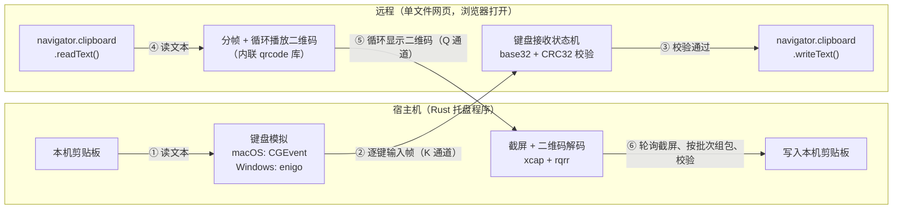
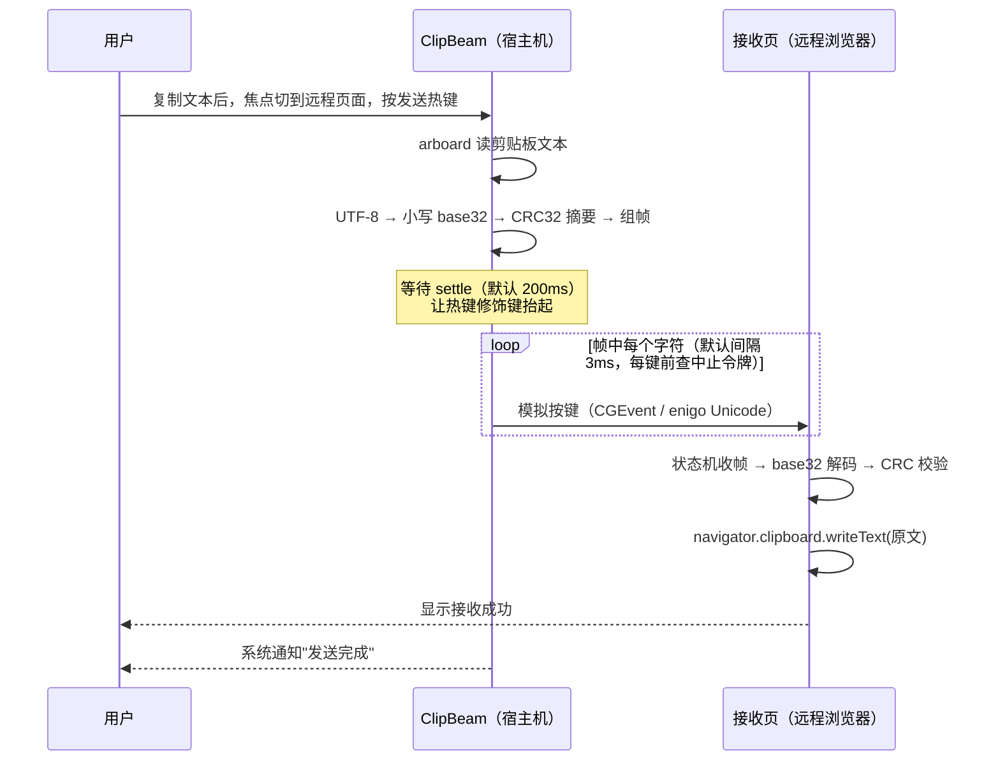
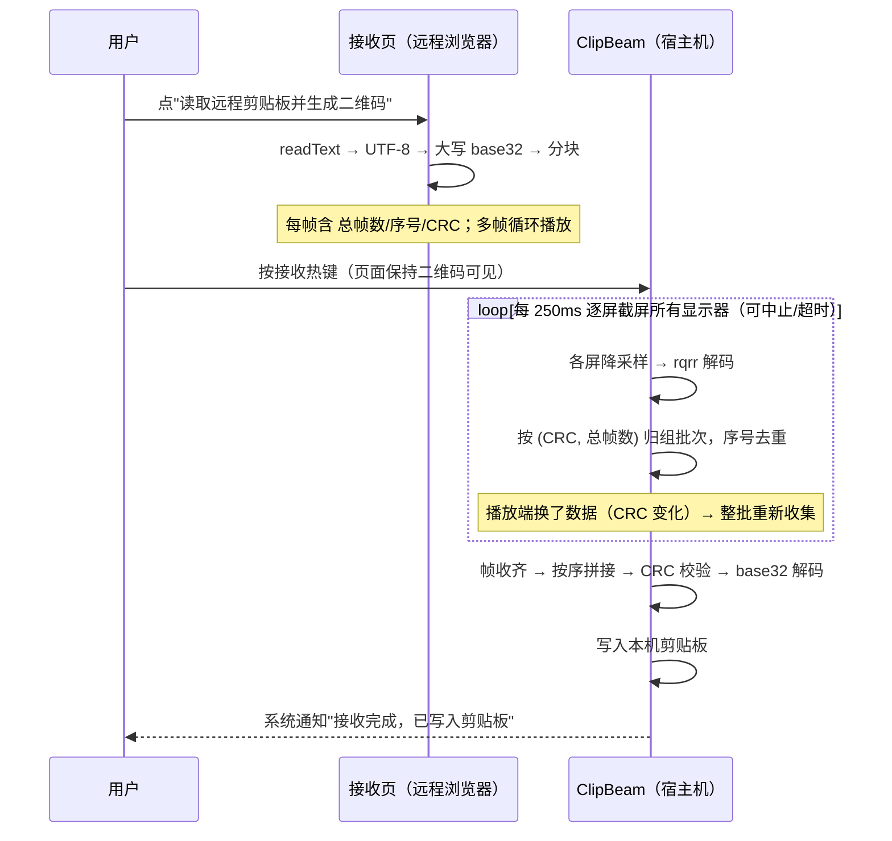
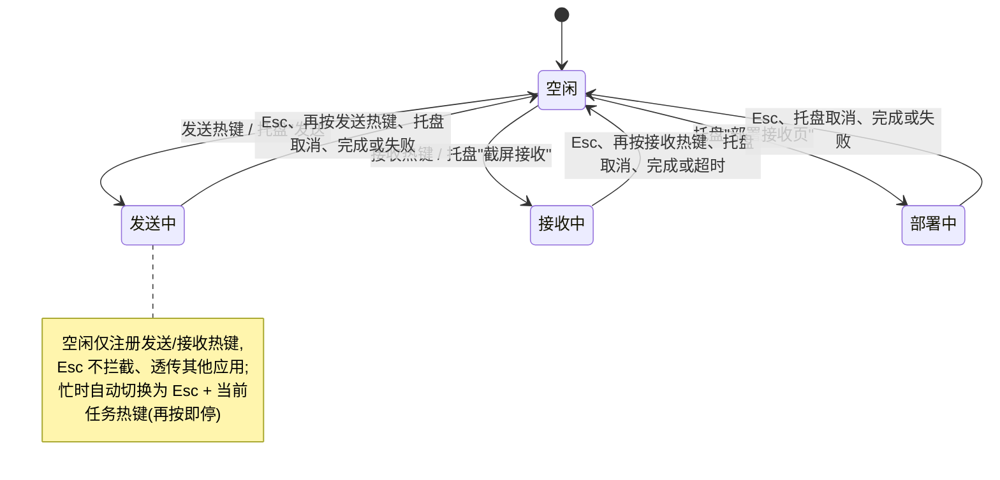

# ClipBeam

宿主机 ↔ 无网络远程环境之间的**剪贴板桥接工具**。

典型场景：通过 VDI / 远程桌面 / 云桌面浏览器访问一台与外网隔离的机器，
无法使用剪贴板同步、无法传输文件。ClipBeam 利用两条"天然存在"的通道：

- **键盘通道**（宿主机 → 远程）：本机模拟逐字符按键，远程网页接收；
- **光通道**（远程 → 宿主机）：远程网页循环播放二维码，本机截屏解码。

远程侧只需要一个**单文件、零依赖、可断网 `file://` 打开**的网页
（`packages/client-vanilla/dist/index.html`，由 `packages/client-vanilla`
构建生成，`pnpm build:web` 即可产出），无需安装任何软件。

---

## 目录

- [工作原理](#工作原理)
- [快速开始](#快速开始)
- [使用方法](#使用方法)
- [脚本引擎（JS/TS）](#脚本引擎jsts)
- [插件框架](#插件框架)
- [配置与设置](#配置与设置)
- [命令行子命令](#命令行子命令)
- [构建](#构建)
- [测试](#测试)
- [协议规范](#协议规范)
- [限制与注意事项](#限制与注意事项)

---

## 工作原理


```mermaid
flowchart LR
    subgraph HOST["宿主机（Rust 托盘程序）"]
        LOCAL_CLIP["本机剪贴板"]
        KB["键盘模拟<br/>macOS: CGEvent<br/>Windows: enigo"]
        CAP["截屏 + 二维码解码<br/>xcap + rqrr"]
        CB2["写入本机剪贴板"]
    end

    subgraph REMOTE["远程（单文件网页，浏览器打开）"]
        PAGE_IN["键盘接收状态机<br/>base32 + CRC32 校验"]
        REMOTE_WRITE["navigator.clipboard<br/>.writeText()"]
        REMOTE_READ["navigator.clipboard<br/>.readText()"]
        QR["分帧 + 循环播放二维码<br/>（内联 qrcode 库）"]
    end

    LOCAL_CLIP -->|"① 读文本"| KB
    KB -->|"② 逐键输入帧（K 通道）"| PAGE_IN
    PAGE_IN -->|"③ 校验通过"| REMOTE_WRITE

    REMOTE_READ -->|"④ 读文本"| QR
    QR -->|"⑤ 循环显示二维码（Q 通道）"| CAP
    CAP -->|"⑥ 轮询截屏、按批次组包、校验"| CB2
```

两条按方向分组的协议 + 一个一次性引导载体：

| 组 | 方向 | 介质 | 帧格式 |
|---|---|---|---|
| **K** | 宿主机 → 远程 | 键盘逐字符 | `0<magic>0<flags>0<7字符CRC摘要>0<tail…>1`；magic = `kba` 文本 / `kbb` 探测 / `kbc` 分片 |
| **Q** | 远程 → 宿主机 | 二维码截屏 | `<magic>.<总帧数>.<序号>.<7字符CRC摘要>.<大写base32块>`；magic = `QBA` 剪贴板 / `QBB` 控制消息 |
| **C** | 宿主机 → 远程 | 键盘（**一次性引导，不算协议**） | 全 ASCII 单行「自解压 HTML」，打开后还原完整接收页 |

两条通道统一使用：

- **base32（RFC4648 无填充）**：K 通道用小写 `[a-z2-7]`，字段分隔只用数字行的 `0`、
  帧终结只用 `1`，全程不产生 Shift 组合键，任何键盘布局都能敲出；
  Q 通道用大写（属于 QR alphanumeric 字符集，单码容量更大）；
- **magic 即消息类型**：没有单独的 `type`/版本字段，新增消息 = 新增 magic，
  旧接收端遇到不认识的 magic 整帧忽略；
- **CRC32（IEEE，多项式 `0xEDB88320`）**：摘要取 4 字节大端再 base32（7 字符）。
  K 通道算在**那一帧**的 tail 上，Q 通道算在**整条消息**上（同批各帧一致，
  兼作批量身份）。Rust 与 TS 各有一份实现，互为校验；
- **整文件用 MD5**：端到端校验，同时充当续传的**会话身份**（`<文件MD5>-<分片大小>`）。

**文本与文件的分工**：`kba` 走**剪贴板文本**（一次一帧、上限 256 KB、无反馈）；
`kbb`/`kbc` 走**文件**（分片、可压缩、带断点续传、局部重传与整文件校验）。
文本/小数据用前者，文件/大数据用后者。

### 宿主机 → 远程（K 通道）时序


```mermaid
sequenceDiagram
    participant U as 用户
    participant App as ClipBeam（宿主机）
    participant Page as 接收页（远程浏览器）

    U->>App: 复制文本后，焦点切到远程页面，按发送热键
    App->>App: arboard 读剪贴板文本
    App->>App: UTF-8 → 小写 base32 → CRC32 摘要 → 组帧
    Note over App: 等待 settle（默认 200ms）<br/>让热键修饰键抬起
    loop 帧中每个字符（默认间隔 3ms，每键前查中止令牌）
        App->>Page: 模拟按键（CGEvent / enigo Unicode）
    end
    Page->>Page: 状态机收帧 → base32 解码 → CRC 校验
    Page->>Page: navigator.clipboard.writeText(原文)
    Page-->>U: 显示接收成功
    App-->>U: 系统通知"发送完成"
```

### 远程 → 宿主机（Q 通道）时序


```mermaid
sequenceDiagram
    participant U as 用户
    participant Page as 接收页（远程浏览器）
    participant App as ClipBeam（宿主机）

    U->>Page: 点"读取远程剪贴板并生成二维码"
    Page->>Page: readText → UTF-8 → 大写 base32 → 分块
    Note over Page: 每帧含 总帧数/序号/CRC；多帧循环播放
    U->>App: 按接收热键（页面保持二维码可见）
    loop 每 250ms 逐屏截屏所有显示器（可中止/超时）
        App->>App: 各屏降采样 → rqrr 解码
        App->>App: 按 (CRC, 总帧数) 归组批次，序号去重
        Note over App: 播放端换了数据（CRC 变化）→ 整批重新收集
    end
    App->>App: 帧收齐 → 按序拼接 → CRC 校验 → base32 解码
    App->>App: 写入本机剪贴板
    App-->>U: 系统通知"接收完成，已写入剪贴板"
```

### 任务忙闲与热键状态


```mermaid
stateDiagram-v2
    [*] --> 空闲
    空闲 --> 发送中: 发送热键 / 托盘"发送"
    空闲 --> 接收中: 接收热键 / 托盘"截屏接收"
    空闲 --> 部署中: 托盘"部署接收页"
    发送中 --> 空闲: Esc、再按发送热键、托盘取消、完成或失败
    接收中 --> 空闲: Esc、再按接收热键、托盘取消、完成或超时
    部署中 --> 空闲: Esc、托盘取消、完成或失败
    note right of 发送中
        空闲仅注册发送/接收热键,
        Esc 不拦截、透传其他应用;
        忙时自动切换为 Esc + 当前
        任务热键(再按即停)
    end note
```

---

## 快速开始

### 1. 构建并启动

```bash
# macOS（推荐）：打包成可双击的 ClipBeam.app
scripts/package-macos.sh --install     # 安装到 /Applications，Spotlight 搜 ClipBeam 启动

# 或直接运行裸二进制（联调用，会带一个终端窗口）
cargo build --release
./target/release/clipbeam          # 无参数 = 常驻系统托盘（macOS 平时不显示 Dock 图标）
```

### 2. 授予权限（仅 macOS）

首次使用时系统会弹窗授权，在 **系统设置 → 隐私与安全性** 中确认：

| 权限 | 用途 |
|---|---|
| 辅助功能 | 模拟键盘输入（发送、部署） |
| 屏幕录制 | 截屏解码二维码（接收） |
| 通知 | 任务完成/失败提示 |

授权后需重启程序生效。

### 3. 把接收页弄到远程（三选一）

1. **键盘部署（无任何通道时）**：远程打开记事本并聚焦 → 托盘菜单选
   **「部署接收页到远程（键盘输入，约 3 分钟）」** → 等待逐字符敲完 →
   把记事本内容另存为 `clipbeam.html`（UTF-8 编码）→ 浏览器打开；
2. **剪贴板部署（远程桌面自带剪贴板同步时）**：托盘选
   **「部署接收页（复制到宿主机剪贴板）」** → 在远程粘贴保存为 `.html`；
3. 执行 `pnpm build:web` 构建接收页，把产物
   `packages/client-vanilla/dist/index.html` 通过任意可用方式传过去。

### 4. 双向使用

接收页在远程浏览器打开后（断网亦可，`file://` 直接打开）：

- **宿主机 → 远程**：本机复制文本 → 鼠标点一下远程页面使其获得焦点 →
  按 `Cmd+Shift+K`（Windows 为 `Ctrl+Shift+K`）；
- **远程 → 宿主机**：远程页面点 **「读取远程剪贴板并生成二维码」** →
  二维码开始循环播放 → 宿主机按 `Cmd+Shift+J`。

---

## 使用方法

### 发送（宿主机 → 远程）

1. 在宿主机复制任意文本（限纯文本，默认上限 256 KB）；
2. 把焦点切到远程浏览器的 ClipBeam 页面（点击页面任意位置）；
3. 按发送热键，或托盘菜单选「发送本机剪贴板 → 远程」；
4. 程序等待 200ms 让修饰键抬起，然后逐键敲入协议帧，页面收到后自动：
   校验 CRC → base32 解码 → 写入远程剪贴板 → 页面提示成功。

> 页面上的「暂停接收」复选框：当你需要在页面输入框里打字时勾选，
> 避免键盘状态机误收普通击键。

**紧急中止**：发送是逐键模拟，若发现焦点不对、按键触发了异常操作，立即：

- 按 **Esc**（中止热键，默认）；
- 或**再按一次发送热键**；
- 或托盘菜单选「取消」。

每敲一个字符前都会检查中止令牌，最坏停止延迟约等于一个键间隔（默认 3ms）。

### 接收（远程 → 宿主机）

1. 在远程页面「② 发送出站」区点 **「读取远程剪贴板并生成二维码」**；
   - 若浏览器拒绝 `navigator.clipboard.readText()`（权限策略限制），
     把文本粘贴到出现的文本框，点「用上方文本生成二维码」；
   - 「高级」可调整每帧字符数（默认 800）与每帧停留时长（默认 300ms）；
2. 二维码以全屏遮罩**固定居中循环播放**（页面滚动/缩放都不影响截屏区域），
   浮层上实时显示当前帧/总帧数；**点击浮层任意处即关闭并停止播放**
   （也可使用页面上的「■ 停止播放」按钮）；
3. 宿主机按接收热键（`Cmd+Shift+J`）或托盘选「截屏接收远程二维码」；
4. 程序每 250ms 对**所有显示器**逐屏截屏解码（多显示器无需指定屏幕，
   运行中热插拔也能自动适配），按 `(CRC, 总帧数)` 批次自动去重组包；
   播放中途换了一批数据会自动整批重来；
5. 收齐且 CRC 校验通过后写入本机剪贴板并弹通知；默认 120 秒超时。

中止方式同样有三种：**Esc**、再按一次接收热键、托盘取消。

### 发送文件（宿主机 → 远程，K 通道的 `kbb`/`kbc`）

文本用「发送」，**文件用「发送文件」** —— 后者会分片、尝试压缩、带断点续传、
局部重传与整文件校验。

**远程侧先做一次授权**（只需一次）：在远程页面「接收文件」区点
**「选择保存目录」**，浏览器会让你挑一个目录。之后收到的分片会写进该目录下的
`.clipbeam-tmp/<会话键>/`，收齐后拼成完整文件、校验整文件 MD5、写入目标文件，
**成功后才**清理临时分片。

**宿主机侧**：托盘菜单选 **「发送文件到远程(键盘通道)」**，或在主窗口仪表盘点
**「发送文件到远程」** → 选文件 → 程序弹待命窗口，点一下远程浏览器页面即开始。

传输流程：

1. 读文件 → 整体 zstd 试压（压后 < 95% 才真的用）→ 按 4096 字节分片；
2. 先敲一个**探测帧**（总片数 + 原始大小 + **分片大小** + 文件名 + 整文件 MD5）；
3. 页面右下角的**反馈二维码**会实时更新状态，宿主机脚本用 `$.scan_qr()` 读它：

   | 状态 | 含义 |
   |---|---|
   | `unauthorized` | 还没授权目录 —— 脚本会提示你先去页面点授权，并继续等 |
   | `ready` | 从第 0 片开始发 |
   | `partial` | 只缺 `missing` 里列的那些片，**只补缺口**（能跳过中间空洞） |
   | `complete` | 远端已有同一文件（`saved` 是实际文件名）—— 一个字符都不用敲 |
   | `error` | 带 `reason`，脚本中止 |

4. 分片按**窗口 16 片**一批发送，批间读一次反馈；有缺口就只补缺口，最多 10 轮。

因此**中止后重新发送同一个文件会自动续传**：页面用
`<文件 MD5>-<分片大小>` 定位上次的分片目录（所以同名不同内容、或改了分片大小都不会
用错片），校验每片长度后报告缺口，宿主机只补缺的那几片。

**同名文件不会被覆盖**：目标目录已有同名文件时，内容相同则**幂等跳过**（不重写），
内容不同则落盘为 `报告 final (1).pdf` 这样带序号的名字，并通过 `saved` 字段告知宿主。

> **可调参数在脚本里**：分片字节数、每键延迟、是否压缩、补发轮数、窗口大小、两个超时
> 都在 `04-file-transfer.ts` 顶部的常量区。托盘「发送文件到远程」用的是一份**内嵌了
> 所选路径**的临时副本，不会覆盖你脚本目录里那份。

**降级**：如果宿主机读不到反馈（没给屏幕录制权限、或跑在命令行/headless 环境），
脚本会打印一条明确警告，然后**一次性盲发全部分片** —— 仍然能送达，但没有续传、
没有局部重传、也不做整文件校验。这是刻意的行为（而不是静默失败）。

**中止**：与文本发送一致 —— **Esc**、再按一次发送热键、或托盘取消。

> **耗时**：键盘通道正比于字符数。base32 膨胀约 1.6 倍，按默认 3ms/键估算
> **约 3000 字符/秒**；1 MB 不可压缩文件约 5500 字符/片 × 256 片 ≈ 8 分钟。
> 可压缩的文件（文本、日志、源码）会显著更快。

### 调试输出（排障用）

两处都有 `console.debug`，**默认都不吵**，需要时再打开。

**接收页（远程浏览器）**：默认关闭。在远程页面的控制台里执行下面任一条，然后刷新页面：

```js
localStorage.setItem('clipbeam-debug', '1')   // 打开
localStorage.removeItem('clipbeam-debug')     // 关掉，回到 URL 判定
```

或者给页面 URL 末尾加 `#debug`（也认 `?debug=1`）。`localStorage` 优先于 URL，
所以 `localStorage.setItem('clipbeam-debug', '0')` 能临时压掉 URL 里的 `#debug`。
打开后每帧一行摘要（`[clipbeam:transfer]` / `[clipbeam:text]` 前缀，便于过滤）：
探测帧内容、会话键、续传重建结果、每片的字节数、缺口区间、拼装与 MD5 校验各步、
同名冲突的处理、以及失败原因。**不会逐字符打印**（键盘通道约 300 字符/秒，逐字符会淹掉控制台）。

> 为什么这件事需要改构建配置：部署到远程的是 `client-vanilla` 的压缩产物
> （协议 C 内嵌 `dist/index.html`）。如果那里用 terser 的 `drop_console: true`，
> **包括 `debug` 在内的所有** `console.*` 调用都会被删掉，远程页面上一条日志都不会有。
> 所以 `packages/client-vanilla/vite.config.ts` 改成只丢弃
> `log`/`info`/`warn`/`error`，专门留下 `debug` —— 留下的它由上面的开关控制默认不输出，
> 正常使用时控制台依然干净。

**脚本（`04-file-transfer.ts`）**：输出走脚本自己的 Console 面板（CLI 下是 stdout），
由脚本顶部的 `DEBUG` 常量控制，默认开。`console.log` 打的是**进度**（已发多少片、用时），
`console.debug` 打的是**细节**（帧长、窗口边界、反馈原文、待发片队列、每片字节数）。
只关心结果就把 `DEBUG` 改成 `false`。

### 托盘菜单

| 菜单项 | 说明 |
|---|---|
| 状态 | 当前空闲/忙（不可点击；进度显示在独立进度窗口） |
| 发送本机剪贴板 → 远程 | 触发一次 K 通道文本帧（`kba`）发送 |
| 截屏接收远程二维码 | 触发一次 Q 通道接收（`QBA`） |
| 发送文件到远程(键盘通道) | K 通道 `kbb`/`kbc`，选文件后分片推送（带续传、局部重传与整文件校验） |
| 部署接收页到远程（键盘输入，约 3 分钟） | 协议 C（引导载体），逐键敲自解压引导页 |
| 部署接收页（复制到宿主机剪贴板） | 协议 C（引导载体），走远程桌面自带剪贴板 |
| 脚本编辑器… | 打开独立的脚本大窗口（编辑 + 运行 + Console 面板） |
| 设置… | 打开设置窗口 |
| 退出 ClipBeam | 退出常驻程序 |

任务运行期间，执行类菜单项自动禁用。

> **进度窗口**（420×96 的悬浮面板）：任务启动时自动弹出，四行显示
> 「任务 + 状态 + 百分比 + ✕」「进度条」「已输出/速度/剩余/已用 或 结果标题」「脚本输出片段 或 结果说明」。
> 默认出现在**鼠标所在显示器**的右上角（避开菜单栏 / 任务栏），可以按住面板拖动，
> 拖过的位置在本次运行内会被记住；点右上角 **✕** 随时收起。
> 任务结束后 **5 秒**自动隐藏 —— 但只要你**碰过**它（鼠标移到上面、点一下、或拖一下，
> 都说明你在关心这次结果），它就**不会自动消失**，留着让你看清楚，由你手动点 ✕ 关闭。

---

## 脚本引擎（JS/TS）

除了「发送本机剪贴板」这类固定动作，ClipBeam 还内置了一个**嵌入式脚本引擎**：
用 JavaScript / TypeScript 编排整个流程（读文件 → 计算摘要 → 压缩分片 → 逐键输出），
适合「把某个文件的多个分片依次敲进远程窗口」这类固定脚本化场景。

```js
// `$`（正式名 `ClipBeam`）是引擎挂上的能力命名空间；`sleep` 是引擎提供的全局（要 await）
const bytes = await $.read('~/data.bin')   // 读真实文件（只接受**绝对路径**）
const parts = $.chunks($.zstd(bytes), 1024) // 先压缩，再按 1 KiB 分片（两件事分开）
$.type_str(`共 ${parts.length} 片\n`, 10)  // 逐键打进当前焦点窗口
for (let i = 0; i < parts.length; i++) {
  if (await $.confirm(`发送第 ${i + 1} 片？`)) {
    await sleep(1000)                       // 全局 sleep，必须 await
    $.type_str(`${i}\n${$.base32_nopad(parts[i])}\n`, 10)
  }
}
```

### 三层结构

| 层 | 位置 | 职责 |
|---|---|---|
| 引擎（core） | `crates/script-engine/` | 跑 JS/TS（QuickJS + oxc 进程内转译）、`sleep` / `console` / `TextDecoder` / `TextEncoder` / 定时器 / `atob`·`btoa` / `performance` / `structuredClone`、**能力扩展机制**、**命名空间配置**（名字由使用方给） |
| 使用方能力集 | `crates/clipbeam-scripting/` | **决定命名空间叫什么**（`NAMESPACE` / `NAMESPACE_ALIAS`）；用扩展机制注入 ClipBeam 需要的能力：编解码（hex / base32 / base64）、摘要（md5 / crc32）、压缩（zstd / gzip / brotli / xz）、文件系统（`$.read` / `$.write` …）、宿主交互（`$.type_str` / `$.confirm` / `$.pick_path`）、屏幕扫描（`$.scan_qr`）；`ScriptHost` 定义；脚本目录与内置示例；终端宿主 |
| 应用 | `src-tauri/`（`scripting.rs` / `standby.rs` / `console_panel.rs` / `script_runner.rs`） | 接 Tauri 命令、Worker 任务、`Typer` 键盘输出、**系统原生确认框与文件授权框**、**惰性待命窗口**、**Console 面板缓冲** |

引擎本身**不认识**剪贴板 / 键盘 / Zstandard，**也不给能力命名空间起名字**：它建一个匿名对象，
名字（`ClipBeam` / `$`）由使用方在 `RuntimeOptions::namespace` 里配置 —— 引擎里没有一处业务名字。
能力再由使用方通过 `ScriptExtension` 注入（新增能力只要实现 `register` + `spec` 两个方法）。

命名空间挂上是**不可写、不可配置**的，所有扩展注册完后对象会被 `Object.freeze`：
脚本改不了能力（`$.md5 = null` 会直接报错）。`$` 由引擎提供，所以脚本里**不要**再写
`const $ = ClipBeam`（会报 `redeclaration of '$'`），直接用 `$` 即可。

### 能力一览

凡是接收二进制的能力都接受三种入参：`string`（按 UTF-8 编码）、`ArrayBuffer`、任何
`ArrayBufferView`（`Uint8Array` / `DataView` …，按 `byteOffset` + `byteLength` 取）。

| 能力 | 说明 |
|---|---|
| `$.bytes(data)` | 统一成 `ArrayBuffer`（字符串按 UTF-8） |
| `$.str(data, encoding?)` | 字节 → 文本（默认 `utf-8`，支持全部 WHATWG 标签） |
| `$.chunks(data, chunkSize?)` | 按 `chunkSize` 分片（默认 1024）：字符串按**码点**切返回 `string[]`，二进制按**字节**切返回 `ArrayBuffer[]` |
| `$.hex` / `$.hex_upper` / `$.hex_decode` | 十六进制编解码（解码大小写均可） |
| `$.base32` / `_nopad` / `_lower` / `_lower_nopad` | RFC4648 Base32：大写+填充 / 大写无填充 / 小写+填充 / 小写无填充 |
| `$.base32_decode` / `_nopad_decode` / `_lower_decode` / `_lower_nopad_decode` | 与上面一一对应；**严格**校验大小写与填充 |
| `$.base64` / `_nopad` / `_url` / `_url_nopad` + 对应 `*_decode` | 标准盘表与 URL-safe 盘表，各自带/不带填充 |
| `$.md5(data, format?)` | MD5 摘要，格式名与 `crc32` 对齐：`hex`（默认，**小写** 32 位）/ `hex_upper` / `base32`（26 字符）/ `base32_lower` / `base64`（22 字符）。协议指纹用 `base32_lower` —— 编的是**摘要的原始 16 字节**，不是十六进制字符串 |
| `$.crc32(data, format?)` | CRC-32（大端）：`hex`（默认，8 位**大写**）/ `hex_lower` / `base32`（7 位）/ `base32_lower` / `base64`（6 位）。注意它与 `$.md5` 的 `hex` 默认大小写不同（各自的历史默认），要消除歧义就用 `hex_lower` / `hex_upper` |
| `$.basename(path)` | 路径最后一段（**同时按 `/` 与 `\` 切**，跨平台结果一致；忽略尾部斜杠） |
| `$.dirname(path)` | 去掉最后一段后的目录部分（不留尾部斜杠；没有剩余时返回空串） |
| `$.extname(path)` | 扩展名（含点）；点开头的隐藏文件没有扩展名（`a/b/.bashrc` → `""`） |
| `$.stem(path)` | 文件名去掉扩展名（`a.tar.gz` → `a.tar`） |
| `$.format_duration(seconds)` | 秒 → `45s` / `1m23s` / `1h2m3s`。**单位是秒**，毫秒请先 `/1000` |
| `$.format_bytes(bytes)` | 字节 → `512B` / `1.5KB` / `2.00MB` / `1.50GB`（1024 进制，与 Rust 侧一致） |
| `$.zstd(data, level?)` | Zstandard 压缩（默认级别 3）；**只压缩不分片** |
| `$.gzip` / `$.gunzip` | gzip 压缩（默认 6）与解压 |
| `$.brotli` / `$.unbrotli` | Brotli 压缩（默认质量 5）与解压 |
| `$.lzma` / `$.unlzma` | xz（LZMA2）压缩与解压，产物兼容 `xz` / `7z` / `tar -J` |
| `$.read` / `$.read_text` | 读文件（字节 / 带编码的文本），只读不询问 |
| `$.exists` / `$.stat` / `$.list` | 存在性、元信息（大小 / 类型 / 修改时间）、目录条目 |
| `$.write` / `$.write_text` / `$.append` / `$.append_text` | 写 / 覆盖、追加（**会先询问**；父目录需已存在） |
| `$.mkdir` / `$.remove` / `$.rename` / `$.copy` | 建目录（递归）/ 删除（目录递归）/ 改名移动 / 复制（目录递归），**都会先询问** |
| `$.type_str(text, delayMs?)` | 把文本交给宿主输出：GUI 下逐个字符打进**当前焦点窗口**，命令行下打印到终端 |
| `$.confirm(message)` | 向用户提问：GUI 下弹**系统原生**确认框（是 / 否 / 取消），命令行下读 stdin；回答「是」为 `true`、「否」为 `false`、取消/中止时抛异常，**不设超时**（一直等用户回答） |
| `$.pick_path(prompt?, kind?)` | 让用户挑一个文件或文件夹：GUI 下弹**系统原生**选择框（`prompt` 是标题，`kind` 为 `"file"`（默认）/ `"dir"`），命令行下在终端里输入一行路径；返回**绝对路径**，取消（或没有选择界面）时返回 `null`。选到的路径**不额外授权**：照样受下面三条规则约束 |
| `$.request_focus(hint?)` | 请求用户把焦点切到目标窗口并等待确认：GUI 下弹出待命窗口（`hint` 是显示给用户的提示，如「请点击远程记事本」），命令行下直接返回。脚本要在**中途**换一个输出目标时调用它 |
| `$.scan_qr()` | **截屏一次**并解出画面里的第一条二维码文本；没扫到、或当前环境不支持屏幕访问（命令行 / headless）时返回 `null`。**不轮询、不超时、不认识任何协议** —— 节奏与解析都由脚本决定。任何「让远程屏幕显示二维码、本机读回来」的脚本都能用它，不限于文件传输 |
| `console.log/info/debug/warn/error` | 写到脚本窗口底部的 **Console 面板**（按等级着色）；命令行运行时打到终端 |
| `sleep(ms)`（**标准全局**） | 异步等待；等待期间被中止会立即返回。返回 Promise，**必须 `await`** |
| `setTimeout` / `setInterval` / `clearTimeout` / `clearInterval` | 定时器；**只属于本次运行**，脚本结束时统一清理 |
| `performance.now()` / `structuredClone(v)` | 单调时钟 / JSON 语义深拷贝 |
| `atob` / `btoa` | WHATWG 语义的 base64（只处理 Latin-1 字符串） |
| `TextDecoder` / `TextEncoder` | 支持全部 WHATWG 编码标签（`utf-8` / `gbk` / `gb18030` / `big5` / `shift_jis` …） |

### 文件系统的三条规则

1. **只接受绝对路径**。`~`（主目录）、`C:/x`、`C:\x`、git-bash 的 `/d/x`、Cygwin 的
   `/cygdrive/d/x` 都算绝对路径；相对路径直接报错 —— 脚本的工作目录取决于宿主怎么启动，
   放行相对路径等于埋雷。
2. **修改要问一次**。只读操作（`read` / `read_text` / `exists` / `stat` / `list`）不问；
   写、追加、建目录、删除、改名、复制每次都会弹一个三按钮系统框：
   `允许一次` / `本次运行内该目录都允许` / `拒绝`。「本次运行内都允许」记在**本次运行**里，
   运行结束即失效（下次运行重新问）。命令行下非交互（管道 / 重定向）时一律按**拒绝**处理。
3. **选路径不等于放行**。`$.pick_path` 只把路径字符串给你，不解除任何限制：
   `read` 本来就不询问，写 / 删 / 改名 / 复制依旧会弹授权框（第 2 条）。

脚本里可以直接使用**顶层 `await`**，不需要包 `async` IIFE。

### 运行方式

**GUI**：托盘菜单「脚本编辑器…」，或主窗口侧边栏 / 仪表盘的「脚本」按钮
→ 打开**独立的脚本大窗口**（1100×760，可缩放；左侧是脚本列表，右侧是编辑器 + Console）
→ 选/新建脚本 → 点「运行」。

脚本是一个独立窗口而不是主窗口里的一个页面，原因有三：编辑器需要足够的空间；
它可以和主窗口/进度窗口并排摆放；关闭主窗口（托盘模式）后脚本窗口仍可独立使用。

> **Dock 图标**：平时不占 Dock（托盘常驻），但**脚本窗口可见期间会显示 Dock 图标**，
> 这样你可以把编辑器丢到另一块屏幕、用 Cmd+Tab 切回它；脚本窗口一关，Dock 图标随之消失。
> 实现见 `src-tauri/src/lib.rs` 的 `sync_dock_icon`（用 Tauri 的 `set_dock_visibility`，
> 它内部对 macOS 的进程类型切换做了防抖）。

**待命窗口只在首次 `$.type_str` 之前弹**：脚本不一定注入键盘事件（例如只读文件、算摘要的脚本），
所以待命窗口是惰性的 ——

* 脚本执行到**第一次** `$.type_str` 时，才弹出待命窗口并等用户点击目标窗口；
* 纯计算脚本（从不输出）**不会有任何待命提示**，直接跑完；
* 同一次运行里只提示一次，后续 `$.type_str` 不再重复打扰；
* 脚本在那之前可能已经读文件、算摘要、打印 `console` 日志 —— 这些都照常执行。

待命窗口有 10 秒倒计时，超时即取消任务。进度窗口会显示「已敲入 N/M 字符 + 当前输出片段」，
按 **Esc**（或点「中止」）随时停下。

#### 焦点锁定与重新确认

一次待命成功 = **锁定**一个目标窗口。之后每次输出前都会校验这个锁（打字过程中每 250ms 一次）：

* **焦点没变** → 直接继续打，不再打扰；
* **焦点换了窗口** → 立刻停手，稍等 50ms 复查一次（吸收系统通知、确认框这类瞬时抖动），
  确认真的换了就**自动重新弹出待命窗口**；用户重新点好目标窗口后，输出**从断点继续**
  （已输入的字符不会重复）；
* 脚本要用**中途**换一个输出目标（例如先打进浏览器、再打进记事本），显式调用
  `$.request_focus("请点击远程记事本")`：会立刻重开一轮待命并显示这句提示（焦点没变也会弹）；
* 待命窗口上的**「暂停检测」**用于「要点好几次才能把焦点切到位」的场景：暂停期间点击任何窗口
  都不会开始输出，倒计时与 10 秒超时**一起挂起**（想切多久都行，不设上限；「取消」与 Esc 始终可用）；
  点**「恢复检测」**回到原来的逻辑（倒计时重新给满），因为按钮把焦点交回了待命窗口，
  所以还需要再点一次目标窗口才会确认。

焦点识别是**窗口级**的：macOS 走系统级 AX API（复用键盘注入本来就需要的那项「辅助功能」权限；拿不到
AX 时回退成「前台应用」级别），Windows 走 `GetForegroundWindow`；两者都不看窗口标题，所以
浏览器切标签、文档改名**不会**被误判成换窗口。其它平台（Linux）不检测，行为与以前一致。

**命令行**：`clipbeam script <文件>`，`$.type_str` 写终端、`$.confirm` / `$.pick_path` 与
文件授权读 stdin（不需要待命窗口：终端的焦点就是当前窗口）；加 `--raw` 时不走逐字打字节奏，
适合把输出重定向到文件或管道。终端里没有原生选择框，`$.pick_path` 退化成「输入一行路径」：
规则与脚本里的路径一致（`~`、`C:/x`、`/d/x` 都认），并要求它真的存在、类型对得上；
非交互（管道 / 重定向）时按「没选到」返回 `null`。

### 脚本目录

```
macOS   ~/Library/Application Support/ClipBeam/scripts/
Windows %APPDATA%\ClipBeam\scripts\
Linux   ~/.config/ClipBeam/scripts/
```

首次启动会写入四个内置示例（`01-quick-start.js`、`02-ts-demo.ts`、`03-pack-and-shard.ts`、`04-file-transfer.ts`），**已存在的文件不会被覆盖** ——
你可以放心修改示例，下次启动不会还原。GUI 里可以新建 / 编辑 / 保存 / 删除。
其中 `03-pack-and-shard.ts` 演示「压缩 → base32_lower 编码 → 分片 → 逐片以
`cat <<'EOF' > xx.gz.b32.p0001` 敲进远程终端」，接收端拼接 / 校验 / 解码 / 解压用的
`restore.sh` 也由它自己 base32 编码后先敲过去（不压缩、不分片），远端解出来即可运行。
文件能力不受脚本目录限制，可以访问任意**绝对路径**（第一次修改某个目录里的东西时会向你确认）。

### Console 面板

脚本窗口底部是 Console 面板，脚本里的 `console.log/info/debug/warn/error` 会出现在这里
（GUI 不写标准输出——用户看不到；只有命令行运行时才打到终端）：

* 按等级着色（error 红、warn 琥珀、debug 灰），每行带时间；
* 面板里还有运行状态行：`▶ 运行 xxx`、`✓ 完成(输出 N 个字符,用时 Xms)`，
  脚本报错时把引擎的错误原文（含文件名与行列）写成 error 行，中止时写 warn 行；
* 每次运行前清空 —— 面板永远只属于**这一次**运行，排查时不会被上一轮输出干扰；
* 上限 1000 行（狂打印也只保留最后 1000 行），可按等级过滤、可手动清空；
* **高度可调**：拖住面板上方的分隔条改高度（方向键也能微调，`Tab` 聚焦分隔条后按 ↑/↓）；
  高度记在 localStorage，关窗重开还是这个高度；
* **可折叠 / 可最大化**：标题栏右侧的 ⌄ 折叠成一条标题栏，⤢ 让 Console 占满整个编辑区
  （编辑器只是被压到 0 高、不会卸载，所以撤销历史和光标位置都还在；再点一次还原）；
* **自动跟随最新输出**：默认贴底；手动往上翻看历史时暂停跟随，滚回底部自动恢复
  （清空、切换等级过滤也会重新贴底）；
* 日志存在后端，关闭再打开脚本窗口时面板会自动恢复。

### 脚本窗口里的确认框

脚本窗口有三处需要用户确认的危险操作（切换脚本 / 新建 / 删除会丢改动），以及「有未保存修改时
是否先保存再运行」。它们统一走 `@tauri-apps/plugin-dialog` 的 `ask()`，也就是**系统原生 Yes/No 弹框**
—— 与脚本里 `$.confirm` 的观感一致。

> 注意：这里不能用 `window.confirm()`。Tauri 的 webview 会把它接管成插件调用，
> 而权限里只放开了消息类弹框，直接调用会抛 `dialog.confirm not allowed. Command not found`。
> 另外 `dialog:default` 只包含 open/save/message，**不含**消息弹框，必须在
> `src-tauri/capabilities/default.json` 里显式写 `dialog:allow-ask`（或 `allow-message`）。

### 编辑器能力

脚本窗口里的编辑器用 CodeMirror 6（高亮/缩进来自 lezer），**语义能力全部来自一个进程内的
TypeScript 语言服务** —— 补全、悬停、参数信息、诊断问的是同一个服务、同一份虚拟文件表，
所以不会出现「诊断说没问题、悬停说旧类型」这种不一致：

| 能力 | 说明 |
|---|---|
| 补全 | 按上下文给候选：`ClipBeam.` / `$.` 列出全部能力（带签名与 JSDoc）、变量后列出它类型的成员、标识符位置列出作用域内的变量；候选项的详情面板显示签名 + 说明 |
| 悬停 | 悬停任何标识符/表达式显示类型签名 + JSDoc，例如 `(method) ClipBeam.md5(data: BinaryInput, format?: "hex" | "hex_upper" | "base32" | "base32_lower" | "base64"): string`；说明会被清理 Markdown 并截断（最长 260 字），tooltip 限宽 460px、限高 240px，避免盖住代码 |
| 参数信息 | 在调用括号里显示签名并高亮当前参数（编辑器顶部一条，例如 `zstd(data: ArrayBuffer, chunkSize?: number)` + `参数 1/2`） |
| 诊断 | 类型不匹配、拼错方法名、用了运行时不存在的 API 都会标红/标黄（`TS2345:` 这类错误码也一并显示） |
| 编辑体验 | 括号匹配/自动闭合、自动缩进、搜索、`Cmd/Ctrl+Enter` 运行、`Cmd/Ctrl+S` 保存（完整快捷键见脚本窗口右上角的 ⌨ 面板） |

#### 快捷键

脚本窗口右上角有一个 ⌨ 按钮，点开就是完整清单（内容由 `src/lib/clipbeam-script/shortcuts.ts`
提供，与编辑器真实绑定共用同一份键位串，不会漂移）；运行/保存按钮的 tooltip 也会带上快捷键。
macOS 显示 ⌘/⇧/⌥/⌃，Windows/Linux 显示 Ctrl/Shift/Alt：

| 分组 | 动作 | macOS | Windows / Linux |
|---|---|---|---|
| 运行与保存 | 运行脚本 | `⌘⏎` | `Ctrl+Enter` |
| 运行与保存 | 保存脚本 | `⌘S` | `Ctrl+S` |
| 编辑 | 撤销 / 重做 | `⌘Z` / `⌘⇧Z` | `Ctrl+Z` / `Ctrl+Y` |
| 编辑 | 注释 / 取消注释 | `⌘/` | `Ctrl+/` |
| 编辑 | 增加 / 减少缩进 | `⌘]` / `⌘[` | `Ctrl+]` / `Ctrl+[` |
| 编辑 | 整行上移 / 下移 | `⌥↑` / `⌥↓` | `Alt+↑` / `Alt+↓` |
| 编辑 | 删除整行 | `⇧⌘K` | `Shift+Ctrl+K` |
| 编辑 | 全选 | `⌘A` | `Ctrl+A` |
| 查找 | 查找 | `⌘F` | `Ctrl+F` |
| 查找 | 下一个 / 上一个匹配 | `⌘G` / `⌘⇧G` | `Ctrl+G` / `Ctrl+Shift+G` |
| 查找 | 选中下一个相同词 | `⌘D` | `Ctrl+D` |
| 查找 | 跳到行 | `⌥⌘G` | `Ctrl+Alt+G` |
| 补全与提示 | 触发补全 | `` ⌥` ``（Ctrl-Space 在 mac 常被输入法占用） | `Ctrl+Space` |
| 补全与提示 | 接受候选 / 关闭面板 | `⏎` / `Esc` | `Enter` / `Esc` |

> 面板有意只列「常用」部分：方向键、Home/End、多光标（`⌘⌥↑/↓`）、复制行（`⇧⌥↑/↓`）
> 等 CodeMirror 默认键位没有一一列出。

编辑器里的类型来自两个声明文件（`crates/script-engine/src/spec/engine.d.ts` 与
`crates/clipbeam-scripting/src/spec/clipbeam.d.ts`），它们同时被
`pnpm typecheck:scripts`（显式列举）与 `pnpm typecheck:examples`（`crates/tsconfig.json`，
按通配模式覆盖 `seed/` 下的示例）使用，因此**编辑器里的断言与命令行检查一致**。

> 你在**用户脚本目录**里写的 `.ts` 同样有提示：应用启动时会把
> `engine.d.ts` / `clipbeam.d.ts` / `tsconfig.json` 写进那个目录（详见 `plugin.md` §10）。

```bash
pnpm typecheck:scripts    # 用 tsc 检查显式列举的示例（crates/clipbeam-scripting/seed/*.ts）与声明文件
pnpm typecheck:examples   # 编辑器项目：通配覆盖 seed 下的示例（含插件 seed/<id>/index.ts）
pnpm test:editor          # 编辑器语义功能与快捷键格式化的单测
```

> TypeScript 语言服务是**懒加载**的（体积不小）：首次打开脚本页时后台预热，
> 就绪前补全退回「能力清单」版本、悬停不弹框；加载失败也只是退化，不影响编辑与运行。

### 窗口置顶

脚本窗口工具栏有一个「置顶」按钮：打开后窗口始终压在其他窗口之上（`alwaysOnTop`），
方便把编辑器和目标窗口并排摆放。状态不持久化 —— 每次打开脚本窗口回到默认（不置顶）。

### TypeScript 支持范围

`.ts` / `.mts` / `.cts` 会被自动转译（oxc，进程内，**不需要 Node/tsc**）：

| 支持 | 说明 |
|---|---|
| 类型注解 / `interface` / `type` / `as` / 泛型 | 直接剥掉 |
| `enum` / `namespace` | 转成运行时对象 |
| 顶层 `await` | 脚本按 module 解析，因此允许 |
| 现代 JS 语法 | 原样保留，不做 ES 降级 |

| 不支持 | 说明 |
|---|---|
| JSX / TSX | 没有 React 运行时，`.tsx` 会明确报错 |
| 装饰器等需要 helper 的语法 | 明确报错，而不是生成跑不起来的代码 |
| ESM 的 `import` / `export` 值导入 | 运行时是「全局 + async eval」，`import type` 会被移除，值导入暂不支持 |
| source map | 运行期报错的**行列号指向转译后的 JS**；语法错误不受影响（诊断直接给 `.ts` 的位置） |

### 安全说明

脚本拥有**与 ClipBeam 同等的本机权限**：`$.read` 可以读任意**绝对路径**、`$.type_str` 会把内容
敲进当前焦点窗口。读操作没有沙箱也没有提示；写 / 删 / 改名 / 复制 / 建目录每次都会弹系统框
确认（可以放行「本次运行内该目录」）。请只运行你信任的脚本。

---

## 插件框架

脚本解决「**这一次**按几步做完某件事」；插件解决「**长期**给应用加一个功能入口」——
自己的托盘菜单项、自己的提示与对话框（以及后续版本的自定义窗口）。两者都写 JS/TS，
但生命周期、入口与能力集是分开的：插件常驻、由菜单触发，且**没有**键盘注入能力。

> 完整设计（实现步骤、未来能力、使用说明）见 [`plugin.md`](./plugin.md)。本节是速查。

### 插件长什么样

`<配置目录>/ClipBeam/plugins/<id>/` 下的一个目录，**目录名必须等于清单里的 id**：

```
macOS   ~/Library/Application Support/ClipBeam/plugins/
Windows %APPDATA%\ClipBeam\plugins\
Linux   ~/.config/ClipBeam/plugins/

hello-plugin/
├── plugin.json     清单：身份 / 入口 / 权限 / 托盘菜单
├── index.ts        入口（也可以写 .js；.ts 会用 oxc 在进程内转译）
└── relay.html      可选：`$plugin.window` 打开的页面（沙箱 iframe，只能用 postMessage）
```

插件目录里还会被应用写入三个文件 —— `engine.d.ts`、`plugins.d.ts`、`tsconfig.json`
（脚本目录同理：`engine.d.ts`、`clipbeam.d.ts`、`tsconfig.json`）。
它们让 `.ts` 脚本/插件在编辑器里**有类型提示、写错就报红**，而运行环境（QuickJS，无 DOM）
与编辑器看到的一致。这三个文件是**产物**（每次启动覆盖），改它们没有意义，要改类型请改仓库里的源声明。

首次启动会释放一个内置示例 `hello-plugin`（**已存在的文件不会被覆盖**，也不会自动启用）。

`plugin.json`：

```jsonc
{
  "id": "hello-plugin",          // 必填，须与目录名一致
  "name": "示例插件",             // 缺省用 id
  "version": "0.1.0",            // 缺省 0.0.0
  "entry": "index.ts",           // 缺省 index.js；示例用 .ts 所以显式写出来
  "permissions": {               // 缺省一个都不开
    "feedback": true,            // $plugin.toast
    "notification": true,        // $plugin.notify
    "system_dialog": true,       // $plugin.alert / $plugin.confirm
    "tray": true,                // $plugin.tray.* 与下面的 menus
    "window": true               // $plugin.window.*
  },
  "menus": [                     // 托盘动作菜单（需要 tray 权限）
    { "id": "hello", "label": "打个招呼" }
  ]
}
```

### 插件能力 `$plugin`

命名空间是 `ClipBeamPlugin`（别名 `$plugin`）——与脚本的 `$`（`ClipBeam`）**不是同一个对象**，
插件里也没有 `$.type_str` / 待命窗口那一套。

| 能力 | 说明 | 需要权限 |
|---|---|---|
| `$plugin.toast(message, options?)` | 应用内提示（右下角），**不阻塞**；`level` 取 `info` / `success` / `warning` / `error`，`durationMs` 缺省 4000（0 = 不自动消失） | `feedback` |
| `$plugin.notify(title, body?)` | 系统通知（macOS 通知中心 / Windows Toast） | `notification` |
| `$plugin.alert(message, options?)` | 系统原生提示框（只有一个「好」），`await` 到用户点掉 | `system_dialog` |
| `$plugin.confirm(message, options?)` | 系统原生确认框：主按钮 `true`、次按钮 `false`、关闭/超时/第三个按钮 `null`；`options.buttons` 可换自定义文案 | `system_dialog` |
| `$plugin.tray.onAction(cb)` | 登记托盘菜单动作回调（`cb` 收到 `{ id }`，`id` 是 `menus[].id`） | `tray` |
| `$plugin.tray.setTooltip(text)` | 托盘鼠标悬停提示 | `tray` |
| `$plugin.tray.setIcon(path)` | 托盘图标（相对插件目录的图片） | `tray` |
| `$plugin.tray.setBadge(text \| null)` | 徽标文字（落在托盘状态行） | `tray` |
| `$plugin.window.open(options?)` | 开一个自己的窗口，页面取自插件目录（**沙箱 iframe**，见下） | `window` |
| `$plugin.window.post(id, msg)` | 往窗口页面发消息（页面用 `window.onmessage` 收） | `window` |
| `$plugin.window.onMessage(id, cb)` | 收窗口页面发来的消息 | `window` |
| `$plugin.window.onClosed(id, cb)` | 窗口关闭（用户关 / 你关 / 页面异常都会触发） | `window` |
| `$plugin.window.close(id)` | 关掉窗口（幂等） | `window` |

```js
// index.ts —— 入口在「启用插件」时执行一次，允许顶层 await
console.log('hello-plugin 已启用')

$plugin.tray.onAction(async (action) => {
  if (action.id === 'hello')
    $plugin.toast('你好 👋', { level: 'success' })
})
```

**窗口的页面不是随便放哪儿都行**：它必须是**插件目录内**的 HTML（越界路径会被拒绝），
而且跑在**沙箱 iframe** 里 —— 页面拿不到宿主的 IPC，只能用 `postMessage` 与插件通信：

```js
// 页面里（沙箱 iframe）
window.parent.postMessage({ hello: 'world' }, '*')
window.addEventListener('message', (event) => console.log('插件说：', event.data))
```

**权限是「声明 → 拒绝未声明调用」**：没在 `plugin.json` 里声明就调用，会当场抛出一条说明
「该往清单里加哪一项」的异常，而不是静默失效。这不是沙箱 —— 插件与 ClipBeam 同进程、
拥有与脚本相同的本机权限，**请只装你信任的插件**。

### 运行与调试

主窗口侧边栏 →「插件」：列表里有状态（已关闭 / 运行中 / 异常 / 清单有问题）、声明的权限、
托盘菜单项与最近错误；可以启用 / 停用 / **重新加载**（改完代码点它生效，当前版本没有热重载），
底部是**该插件的日志**（插件的 `console.*` 与动作执行错误都在这里）。

| 现象 | 原因 |
|---|---|
| 插件列表里显示「清单有问题」+ 原因 | 清单字段写错 / 目录名与 id 不一致 / 入口文件不在 |
| 卡片上出现「未声明 xx 权限」 | `plugin.json` 的 `permissions` 少了对应开关 |
| 点托盘菜单提示「插件没有启用」 | 插件处于关闭状态，去插件页打开它 |
| 状态变成「异常」 | 入口执行报错，错误原文就在卡片上 |
| 提示「疑似卡住」 | 上一个动作超过 5 秒没返回；引擎的中断是协作式的，死循环无法强行打断 |

---

## 配置与设置

托盘菜单「设置…」打开图形设置窗口，所有项实时校验，非法时「保存」禁用：

| 设置项 | 默认值（macOS / Windows） | 合法范围 |
|---|---|---|
| 发送热键 | `Cmd+Shift+K` / `Ctrl+Shift+K` | global-hotkey 语法，如 `Cmd+Shift+K`、`Esc` |
| 接收热键 | `Cmd+Shift+J` / `Ctrl+Shift+J` | 同上 |
| 中止热键 | `Esc` | 同上，三个热键不得重复 |
| 键延迟 | 3 ms/键 | 0–100 ms |
| settle 等待 | 200 ms | 0–5000 ms（热键后等修饰键抬起再开始打字） |
| 接收超时 | 120 秒 | 5–3600 秒 |
| 文本上限 | 256 KB | 1–10240 KB |
| zstd 压缩 | 开 | 开/关（仅 K 通道文本帧，关闭后用未压缩帧便于对比耗时） |

热键支持点击「捕获」后直接按下组合键录入。保存后立即重注册全局热键并通知。

配置文件位置（JSON，可手工编辑；缺字段自动回退默认值）：

- macOS：`~/Library/Application Support/ClipBeam/config.json`
- Windows：`%APPDATA%\ClipBeam\config.json`
- Linux：`~/.config/ClipBeam/config.json`

---

## 命令行子命令

不带参数启动为托盘常驻模式；以下子命令主要用于联调/脚本化：

```bash
clipbeam send-once      # 立即发送一次本机剪贴板（0.2s 后开始，Ctrl-C 强杀）
clipbeam recv-once      # 立即截屏接收，stderr 打印 got/total 进度
clipbeam deploy-type   # 逐键敲入自解压接收页到当前焦点窗口（先切到远程记事本）
clipbeam deploy-copy   # 把自解压接收页复制到宿主机剪贴板
clipbeam script <文件>          # 在终端里运行脚本（.js / .ts，TS 在进程内转译）
clipbeam script <文件> --raw    # 同上，但按整段写出（不逐字模拟打字节奏）
```

---

## 构建

要求 Rust stable（edition 2021）+ Node.js 18+ + pnpm。

pnpm workspace + cargo workspace 单仓多包布局：

- 仓库根：Tauri 主界面（Vue 3 + Vite + TS + shadcn-vue）；`Cargo.toml` 定义 cargo workspace
- `src-tauri/`：Rust crate + Tauri 配置（`clipbeam_lib` + `clipbeam` 二进制）
- `crates/script-engine/`：可嵌入的脚本引擎（QuickJS + oxc），只提供标准全局、扩展机制与命名空间配置
- `crates/clipbeam-scripting/`：使用方能力集（编解码 / 摘要 / 压缩 / 文件系统 / 宿主交互）+ `ScriptHost` + 脚本目录 + 终端宿主
- `scripts/`：示例脚本（供命令行运行；内置示例的真源在 `crates/clipbeam-scripting/seed/`）
- `packages/shared/`：两个 client 共享的协议逻辑（K/Q 帧的构造与解析、base32/CRC、zstd、剪贴板、接收状态机）
- `packages/client/`：浏览器端 Vue 3 收发页（shadcn-vue + Tailwind v4，开发预览用）
- `packages/client-vanilla/`：零依赖单文件接收页，构建产物被 Rust `include_str!` 内嵌用于部署

```bash
# 安装全部 workspace 依赖（仓库根执行一次即可）
pnpm install

# 单独构建远程接收页（产物 packages/client-vanilla/dist/index.html）
pnpm build:web

# Debug 开发模式（Tauri 自动启动 Vite dev server + Rust 编译 + 托盘应用；
# cargo 构建时会按需自动构建 client-vanilla，可用 CLIPBEAM_SKIP_WEB_BUILD=1 跳过）
cd src-tauri && cargo tauri dev

# Release 打包（Tauri 自动：前端构建 + Rust release + bundle）
cd src-tauri && cargo tauri build
```

### macOS：打包成可双击的 .app（推荐）

直接双击裸二进制会打开一个终端窗口，关掉终端程序即退出。用打包脚本生成
标准应用包，启动无终端、平时不占 Dock（仅菜单栏图标；脚本窗口打开期间会临时出现在 Dock），
与普通 Mac 应用一致：

```bash
scripts/package-macos.sh              # 生成 src-tauri/target/release/bundle/macos/ClipBeam.app
scripts/package-macos.sh --install    # 额外安装到 /Applications（Spotlight/Launchpad 可启动）
```

脚本自动完成：`pnpm install`（如需）→ `cargo tauri build`（Tauri 2 接管前端
构建、Rust release 编译、`Contents/` 与 `Info.plist` 组装、`.icns` 生成）→
ad-hoc 代码签名 → LaunchServices 注册。之后在 Finder 双击或 `open ClipBeam.app`
即可启动，程序由 launchd 托管，关闭终端/SSH 断开都不影响运行。

> 首次启动需在「系统设置 → 隐私与安全性」授予辅助功能、屏幕录制、通知权限；
> ad-hoc 签名的应用与之前裸二进制是不同身份，权限需要重新授权一次。

### 发布新版（改版本号 + 打 tag）

版本号的**真源是 `src-tauri/tauri.conf.json`**（安装包版本就是它，`release` 工作流也用它
校验 tag）；侧边栏显示的版本由 Tauri 的 `getVersion()` 在运行时读取，所以界面里不用改。
一条命令搞定改版本号与后续动作：

```bash
scripts/release.sh patch                 # 0.1.0 → 0.1.1：改版本号 + 跑本地门禁，然后交互问要不要提交/打 tag/推送
scripts/release.sh 0.2.0                 # 指定版本（也接受 0.2.0-beta.1 这类预发布串）
scripts/release.sh minor --dry-run       # 只打印将要改什么，不写文件
scripts/release.sh 0.2.0 --commit --tag --push   # 全自动（会触发 CI 与发版流程）
```

脚本会改这些地方：`src-tauri/tauri.conf.json`、`package.json`、`src-tauri/Cargo.toml`、
`crates/{script-engine,clipbeam-scripting,clipbeam-plugins}/Cargo.toml`，再跑一次 `cargo check` 让
`Cargo.lock` 跟上；随后默认执行与 CI 相同的一套门禁（`fmt` / `clippy -D warnings` /
`cargo test --workspace` / `pnpm lint` / `typecheck:scripts` / `typecheck:examples` /
`test:editor` / `build`，用 `--no-check` 可跳过）。
工作区不干净、版本号不合法、tag 已存在（本地或远端）都会直接拒绝。

推 tag 之后 `Release` 工作流自动跑：`ci`（三平台测试）→ `verify`（tag 必须等于
`tauri.conf.json` 的 version）→ `build`（macOS universal `.dmg` + Windows NSIS
`-setup.exe`），并创建一个**草稿** Release —— 到 Releases 页面检查产物后点 Publish 才对外发布。
想先试跑流水线而不发版：Actions 页面手动 **Run workflow**（只打包出 artifact）。
预发布（例如 `0.2.0-beta.1`）还要把 `.github/workflows/release.yml` 里的
`prerelease: false` 改成 `true`。

平台依赖：

- **macOS**：Xcode Command Line Tools；键盘模拟走 CoreGraphics
  （`CGEventKeyboardSetUnicodeString`，任意线程可用），通知走 Notification Center；
- **Windows**：MSVC 工具链；键盘模拟走 enigo，通知走 Toast（winrt-notification）。

已验证 Windows 目标交叉编译检查：

```bash
rustup target add x86_64-pc-windows-msvc
cd src-tauri && cargo check --target x86_64-pc-windows-msvc
```

托盘图标由 [src-tauri/build.rs](src-tauri/build.rs) 在编译期代码生成（Bresenham K 字
光束 + 青色光点），无需额外二进制资源入库。

---

## 测试

```bash
# 整个 workspace（引擎、脚本能力集、插件框架、Tauri 应用）
cargo test --workspace

# 三个不依赖图形栈的 crate 是 clippy 干净的；src-tauri / build.rs 里有一批历史告警，
# 所以这里只对它们跑 clippy（要做全量门禁需先清掉历史告警）
cargo clippy -p script-engine -p clipbeam-scripting -p clipbeam-plugins --all-targets

# 只跑脚本引擎 / 脚本能力集 / 插件框架（第一次编译 QuickJS 的 C 代码较慢，之后很快）
cargo test -p script-engine
cargo test -p clipbeam-scripting
cargo test -p clipbeam-plugins

# Tauri 侧的协议层单元测试与跨实现 E2E
cd src-tauri
cargo test
cargo run --example qr_e2e   # JS(qrcode-generator) 产出帧 → Rust(rqrr) 解码的跨实现 E2E

# 前端：构建 + 脚本/插件类型检查
pnpm build
pnpm typecheck:scripts                    # 显式列举的示例与声明文件
pnpm typecheck:examples                   # 编辑器项目：按通配模式覆盖 seed 下的示例
pnpm lint
```

> `cargo test -p script-engine` 覆盖：`sleep` / 取消 / 定时器 / `atob`·`btoa` /
> `structuredClone`、`TextDecoder` 的 GBK/BOM/fatal、扩展机制的注册/重名/声明一致性、
> TS 转译与端到端；
> `cargo test -p clipbeam-scripting` 覆盖：入参多态、编码往返与严格解码、md5/crc32 与
> Rust 侧独立实现对齐、压缩往返（gzip 产物再由 Rust 解一遍）、文件读写与**授权策略**
> （拒绝 / 本次运行放行 / 跨运行失效）、`type_str`/`confirm` 的宿主语义、脚本目录与内置示例。
> 命名空间的配置与校验（默认不挂、不可写绑定、冻结对象、非法名字/冲突名报错）由
> `cargo test -p script-engine --test namespace` 覆盖。
>
> `cargo test -p clipbeam-scripting --test transfer_e2e` 是**文件通道的端到端守卫**：
> 跑真正的 `04-file-transfer.ts`，再用**独立重写**的解析器把宿主敲出的帧解回原始字节、
> 与源文件逐字节比对。覆盖正常完成、续传（页面报 `missing` 区间时只补缺口，含**中间空洞**）、
> 读不到反馈时降级为盲发、页面报 `ERROR` 时失败退出四条路径。

### 在浏览器里调试前端（Chrome）

Tauri 的 webview 才会注入 `window.__TAURI_INTERNALS__`，所以直接开 Vite 会白屏 ——
`src/App.vue` 在 setup 里读窗口 label，拿不到就 `TypeError`。现在 dev 模式下会自动装一层
**Tauri mock**（`src/dev/tauri-mock.ts`，用官方 `@tauri-apps/api/mocks`）：

```bash
pnpm dev
# 然后 Chrome 打开其中之一（路由是 hash 模式，与 Tauri 窗口 URL 一致）
http://localhost:5173/            # 主窗口（总览）
http://localhost:5173/#/scripting # 脚本窗口
http://localhost:5173/#/settings  # 设置
http://localhost:5173/#/progress  # 进度（裸布局）
http://localhost:5173/#/standby   # 待命（裸布局）
```

* 窗口 label 默认按路由推断，也可以用 `?window=<main|scripting|progress|standby>` 显式指定；
* 25 条自定义命令走内存夹具（脚本清单/读写、配置、能力清单、Console 缓冲…），
  `start_script` 还会模拟一次运行（推 `worker-*` 事件 + Console 行）；
* `plugin:window|*` 返回合理默认，`plugin:dialog|ask` 一律按"用户取消"返回 `false`；
* 后端事件不会自己发生，用 `window.__CLIPBEAM_DEV__` 手动造：

```js
__CLIPBEAM_DEV__.emit('worker-started', 'send')       // 状态徽标变成"发送"
__CLIPBEAM_DEV__.consoleLine('error', '手造一行错误')  // Console 面板立刻出现红行
await __CLIPBEAM_DEV__.runScript('01-quick-start.js') // 演练一次完整运行
```

> **不覆盖**：真实键盘注入、剪贴板、文件系统、Rust worker 与二维码识别、系统原生弹框 ——
> 这些仍然要真机验证。mock 有 `import.meta.env.DEV` + `__TAURI_INTERNALS__` 存在性双重守卫：
> `pnpm tauri dev` 与生产构建都不受影响（已验证生产产物里不含 mock 代码）。
>
> VS Code 里可以直接用 `Chrome: 前端调试（Vite + Tauri mock）` 这条 launch 配置（F5），
> 断点能命中 `src/**`。

---

## 协议规范

### 总览：按**方向**分组

| 组 | 方向 | 介质 | 帧 | 校验 |
|---|---|---|---|---|
| **K** | 宿主 → 远程 | 键盘逐字符 | `0 <magic> 0 <flags> 0 <crc> 0 <tail…> 1` | 每帧 CRC32 |
| **Q** | 远程 → 宿主 | 二维码截屏 | `<magic>.<total>.<index>.<crc>.<payload>` | 整条消息 CRC32 |
| **C** | 一次性引导 | 键盘 | 自解压 HTML | — |

两条通道共用同一套「校验算法」与「magic 即消息类型」的扩展机制。

**协议 C 不算协议**：它是一次性的引导载体（把接收页送进远程浏览器），送出之后就退出舞台，
既没有会话、也没有反馈，所以不参与上面的分组。

**magic 就是消息类型**，没有单独的 `type` 或版本字段：

| 通道 | magic | 消息 |
|---|---|---|
| K | `kba` | 剪贴板文本 |
| K | `kbb` | 文件探测 |
| K | `kbc` | 文件分片 |
| Q | `QBA` | 剪贴板载荷 |
| Q | `QBB` | 控制消息（JSON） |

新增消息 = 新增 magic；旧接收端遇到不认识的 magic **整帧忽略**，不会半解析出错。
这比「一个 magic + 可选的 type/version」少两个字段、少一层分支。

### K 协议（宿主 → 远程，键盘）

```text
0 <magic> 0 <flags> 0 <crc> 0 <tail…> 1
```

| 字段 | 宽度 | 说明 |
|---|---|---|
| `magic` | 3 | 见上表 |
| `flags` | 1 | 单个 base32 字母表数字（5 bit → `a`..`v`）：bit0 = 载荷/整文件经 zstd，bit1..4 保留 |
| `crc` | 7 | `base32 小写(crc32(<tail 在线上出现的那个子串>))` |
| `tail` | 变长 | 按 magic 定义 |

`tail` 定义：

| magic | tail 字段 |
|---|---|
| `kba` | `<payload>`（1 个字段） |
| `kbb` | `<total> 0 <size> 0 <chunkSize> 0 <name> 0 <fileMd5>`（5 个） |
| `kbc` | `<seq> 0 <total> 0 <size> 0 <chunkSize> 0 <payload>`（5 个） |

- `size` = **原始**文件字节数（接收端用它校验解压后的长度）；
- `chunkSize` = 配置的每片字节数。它在探测帧与**每一片**里都出现：分片帧自带它，
  是为了让「另一个分片大小的会话」的片被**拒收**，而不是混进当前文件；
- `name` = 文件名 UTF-8 字节的 base32；`fileMd5` = md5 原始 16 字节的 base32（26 字符）；
- `payload` = 该片**线上字节**的 base32。

#### 字符集纪律

> **帧内任何字段都不含 `0` / `1`。凡是自然表示里可能出现它们的字段，
> 一律先 `base32 小写无填充`。**

`0` 因此只可能是字段分隔符、`1` 只可能是整帧终结符。base32 小写字母表是
`[a-z2-7]`（RFC4648），它是 `[a-z0-9]` 的**子集** —— 整条流只用字母数字、无一需要 Shift。

| 字段类型 | 编码 | 例 |
|---|---|---|
| 数值 | 十进制串 UTF-8 字节 → base32 | `0`→`ga`、`1`→`ge`、`10`→`geya`、`4096`→`gqydsnq` |
| 摘要 | base32(原始字节) | CRC32 4 字节 → 7 字符；MD5 16 字节 → 26 字符 |
| 文件名 / 文本 / 载荷 | base32(UTF-8 或原始字节) | — |
| `flags` | 单个 base32 数字 | zstd 关 = `a`、开 = `b` |

数值先转十进制字符串再编码，是因为十进制里的 `0`/`1` 只出现在**输入侧**，
编码后必然落在 `[a-z2-7]` 内 —— 于是不需要定宽、不需要长度前缀、不需要回退。

**CRC 算在 tail 的线上子串上**（编码后的字符，不是解码后的字节）：好处是不必先解码
就能验帧，而且它一并覆盖 `seq`/`total`/`size`/`chunkSize`，这些字段被改坏也能当场发现。

**空载荷**：0 字节文件会切成「1 片、载荷为空」。`payload` 是**唯一允许为空**的字段
（它是 tail 的最后一个字段，后面紧跟终结符，所以 `…0<chunkSize>01` 没有歧义）；
其余字段一律非空，接收端把空字段判为非法。

#### Frame 的分流

v2 里文本帧（`0kba`）与文件帧（`0kbb`/`0kbc`）都以 `0` 开头，**第 4 个字符才分岔**。
接收页把每个字符同时喂给两条通道，各自校验前缀、各自复位：文件通道认出 `0kba` 就放手，
文本通道认出 `0kbb`/`0kbc` 也放手。这比引入一个中央路由器简单，也让两条通道能
在同一个页面上共存而互不干扰。

### Q 协议（远程 → 宿主，二维码）

```text
<magic>.<total>.<index>.<crc>.<payload>
```

- `total` / `index`：十进制整数（Q 通道是二维码，不受键盘的免 Shift 约束，
  没必要为它们做 base32 膨胀）；
- `crc`：`base32 大写(crc32(<整条消息 payload 字符串>))`，7 字符；
- `payload`：该帧承载的**片段**，是 `base32 大写(字节)`；
- 分隔符 `.` 属于 QR alphanumeric 字符集，所以整帧能以 alphanumeric 模式编码
  （容量是 byte 模式的两倍）；
- **不需要帧终结符**：一个二维码就是一个完整帧。

> **`crc` 是整条消息的摘要，同一批每一帧都一样。** 这一点与 K 通道刻意不同：
> K 的每一帧是独立投递的，所以校验必须落在**那一帧**上；Q 的若干帧是一组**轮播**的
> 二维码，不是独立投递，校验自然该落在**整条消息**上 —— 它同时充当批量身份
> （换消息就换 crc → 整批重来）和重组完成后的整体校验。

#### 控制消息（JSON，字段用完整名称）

`QBB` 的载荷解出来是 JSON：

```json
{"type":"feedback","status":"unauthorized"}
{"type":"feedback","status":"ready"}
{"type":"feedback","status":"partial","missing":"0-2,7,9-11"}
{"type":"feedback","status":"complete","saved":"报告 final (1).pdf"}
{"type":"feedback","status":"error","reason":"整文件 MD5 不符"}
```

| 字段 | 说明 |
|---|---|
| `type` | 消息类型，目前只有 `feedback`；未知类型忽略 |
| `status` | `unauthorized` / `ready` / `partial` / `complete` / `error` |
| `missing` | 缺失分片区间清单（0-based、`a-b` 闭区间、逗号分隔、**无空格**） |
| `saved` | `complete` 时页面**实际**落盘的文件名（同名冲突时会带 ` (1)` 后缀） |
| `reason` | `error` 时的原因 |

未知 JSON 键一律忽略，所以给控制消息加字段不会破坏旧实现。

> **为什么缺失用「区间清单」而不是位图或连续前缀**：
> 连续前缀（旧方案的 `HAVE n`）表达不了**中间空洞**，做不到局部重传；
> 位图在 25 万片时是 32 KB，编码后要几十个二维码，而丢片在实践里是**成簇**的；
> 区间清单常见只有几十字符，最坏情况（全缺）也只是一个区间，而且它**直接就是要重传的
> 清单**，宿主不必自己求差集。

### 校验算法选择

| 层 | 算法 | 为什么 |
|---|---|---|
| **每帧（K）** | **CRC32** | 职责只是检出传输错误。键盘通道的错误形态是**丢键/重复键**，而 CRC32 正是为突发错误设计的。代价 7 字符，浏览器逐帧验的 CPU 开销也最低 |
| **整条消息（Q）** | **CRC32** | 同上；顺带承担批量身份（同批各帧一致） |
| **整文件** | **MD5** | 一人三角色：① 端到端最终校验；② **文件身份** —— 续传会话键与「同名不覆盖」的判据；③ 兜住某片恰好 CRC32 碰撞的极端情况 |

不选的反面代价：每帧改 MD5 = 每帧多 19 字符、CPU 约 3~5 倍，而对传输噪声买不到额外强度；
整文件用 CRC32 则太弱 —— 32 bit 对「是不是同一个文件」这个判断，在生日问题下几千次比较
就可能撞上，而且拼装错误无法定位。

**残差**：某片通过 CRC32 却内容有误的概率约 2.3×10⁻¹⁰/片。真发生时会**在最终 MD5 处失败**，
页面报 `error` 并**保留**临时分片，宿主可以重试。

### 分片、会话身份与续传

**发送端流水线**（顺序不能换）：

```text
读文件 → 整文件压缩（压缩后 < 95% 才用）→ 切片 → 每片 base32 编码 → 组帧
```

1. **压缩作用在整文件上，不是逐片**：`flags` 带 zstd 时各分片是**同一条 zstd 流**的切片，
   接收端必须**收齐后整体解压一次** —— 单独一段不是合法的 zstd 帧，逐片解压必然失败；
2. **每片校验算在「送出去的字节」上**（压缩流的这一段），所以接收端**不必解压**
   就能判出坏片并丢弃重传。解压后长度与整文件 MD5 是最终的兜底。

**分片存在的两个理由**，各有机制承接：

| 目的 | 机制 |
|---|---|
| 断点续传 | 探测帧 + 临时分片目录 + 页面回报缺失区间 |
| 局部重传（含中间空洞） | 每片独立校验 + 缺失区间清单（能精确跳过中间空洞） |

**会话身份 = 文件内容 + 分片大小，而不是文件名**：

```text
会话键 = <fileMd5 十六进制>-<chunkSize>        例：d41d8cd9…427e-4096
临时目录 = <授权目录>/.clipbeam-tmp/<会话键>/p<seq>
```

| 情况 | 结果 |
|---|---|
| 同名但内容不同 | `fileMd5` 不同 → 会话目录不同，**分片绝不混用** |
| 同一文件但分片大小变了 | `chunkSize` 不同 → 旧片不会被错当成新会话的片（字节边界完全不同，混用会拼出垃圾） |
| 内容与分片大小都相同 | 同一会话 → 正常续传（源文件改名也不影响） |

会话键是纯 `[a-z2-7]` + `-` + 数字，**不需要任何路径消毒**；而且续传时还会
**校验每片长度**（除最后一片外必须正好是 `chunkSize`），把「上次写到一半就被中断」
留下的截断片删掉重收。最后一片的长度不按文件总大小精确算，是因为 zstd 时送上线的
是压缩流，其长度与原始大小无关 —— 那一段交给整文件 MD5 兜底。

**发送节奏**：窗口 16 片一批，批间读一次反馈。逐帧 ACK 会让每片都多一次二维码往返，
而键盘通道的瓶颈正是击键数；窗口把往返摊薄，同时把单轮的丢失范围限制在窗口内。

### 同名文件与落盘时序

```text
收帧 → 先验 CRC32（不过 → 丢弃，不落盘）
     → 校验帧的 total/size/chunkSize 与会话一致（不一致 → 拒收）
     → 通过才写入 <授权目录>/.clipbeam-tmp/<会话键>/p<seq>
     → 收到探测帧：定位会话目录 → 校验各片长度 → 算缺失区间 → 回报 partial
     → 缺失区间为空 → 按 seq 拼接 →（zstd）整体解压 → 校验长度 == size
     → 校验整文件 MD5 == fileMd5
     → 通过：按下面的规则确定最终文件名 → 写入授权目录
             → 删除 .clipbeam-tmp/<会话键>/
             → 回报 complete（带 saved）
     → 失败：**保留**临时分片，回报 error（保留才能续传与诊断）
```

**最终文件绝不覆盖同名文件**：

| 情况 | 行为 |
|---|---|
| `<name>` 不存在 | 写 `<name>` |
| `<name>` 存在且 MD5 相同 | 幂等：**不重写**，直接回报 `complete`（`saved` = `<name>`） |
| `<name>` 存在且 MD5 不同 | 依次试 `<base> (1).<ext>`、` (2)`…，用第一个空位；`saved` 告知实际文件名 |

沿用系统「同名副本」的习惯命名，不覆盖用户已有文件；`saved` 让用户不会
「以为写进去了却找不到」。

### 版本与扩展策略

| 机制 | 用途 |
|---|---|
| magic 即消息类型 | 新增消息不动既有类型；旧接收端遇到未知 magic **整帧忽略**，不会半解析出错 |
| `flags` 保留位（5 bit 中留了 4 位） | 小特性（例如更换压缩算法）不改结构即可加 |
| Q 控制消息是 JSON | 加字段不影响旧实现（忽略未知键）；新增控制消息只需新的 `type` 值 |
| 宿主与接收页版本不匹配 | 宿主等不到可识别的反馈 → 提示「未收到反馈；若远端页面为旧版本，请重新部署」。**不设版本字段**，靠 magic 天然区分 |

## 限制与注意事项

- **文本走 `kba`，文件走 `kbb`/`kbc`**：前者面向剪贴板**纯文本**（图片/富文本会被拒绝，
  请先转成纯文本）；后者面向**任意文件**，不经过剪贴板。文件通道需要远程浏览器
  支持 File System Access API（Chrome/Edge 121+），不支持时文件接收区不可用，
  但文本通道不受影响；
- **键盘通道耗时与长度成正比**：base32 约 1.6 倍膨胀，按默认 3ms/键估算约 3000 字符/秒；
  256 KB 文本约需 20 分钟；开启 zstd 压缩（默认）可显著缩短重复/可压缩内容的耗时，
  但对随机短文本无收益（会自动回退未压缩帧）；
- **文件传输没有网络参与**：分片是逐个字符敲过去的，因此大文件耗时较长；
  可压缩的文件（文本、日志、源码）收益明显；
- **焦点必须在远程页面**：发送前程序不切换任何焦点，请先点击远程页面；
- **键盘布局无关性**：K 通道只使用小写字母与数字行 `0`/`1`，
  不依赖远程当前输入法（中文输入法下仍可正常接收）；
- **浏览器剪贴板权限**：`navigator.clipboard.readText()` 需要用户手势触发
  且受页面权限策略限制，被拒绝时使用页面上的粘贴备选框；
- **反馈二维码的可见性**：文件传输的反馈码固定在远程页面右下角，宿主机截屏读取，
  所以该区域需**完整可见**（未被遮挡/最小化）；读不到时会降级为盲发（无续传、无校验）；
- **二维码可见性**（Q 通道）：多屏环境下会截取所有显示器，二维码出现在任意一块屏幕上
  均可被识别，但该区域需完整可见、未被遮挡/最小化，每屏会降采样到 1600px 宽再解码；
- **安全**：三条通道都没有也不需要网络连接；CRC32/MD5 只防传输错误，不提供机密性，
  屏幕/键盘内容在本地处理，不上传任何数据；文件通道的文件名会以 base32 明文出现在键盘通道上；
- **脚本与本机同权限**：`$.read` 能读任意绝对路径、`$.type_str` 会把内容敲进当前焦点窗口；
  读操作没有沙箱，修改操作会弹框确认（但确认框本身不是安全边界），只运行可信脚本；
- **`$.confirm` 会一直等**：系统确认框不设超时，弹框期间 Worker 保持忙（其他任务无法启动）。
  此时按 Esc 只会**终止脚本**，系统弹框仍留在屏幕上，需要手动点掉；
- **`$.pick_path` 同理**：选择框活着的时候 Worker 也保持忙，Esc 不会替你关掉它 ——
  点「取消」才让脚本拿到 `null` 继续跑。
- **弹框时主窗口会临时显形**：托盘模式下主窗口是隐藏的，而系统弹框需要应用处于激活状态，
  因此确认期间主窗口会短暂显示并获得焦点，回答后恢复隐藏。

## 技术栈

| 层 | 依赖 |
|---|---|
| 应用框架 | Tauri 2（tray-icon feature）、tauri-plugin-global-shortcut、tauri-plugin-clipboard-manager、tauri-plugin-notification |
| 插件框架 | `clipbeam-plugins`（清单 / 发现 / 权限 / `$plugin` 能力）；一个插件一条线程 + 一个 QuickJS 运行时 |
| 前端 | Vue 3 + Vite + TypeScript + Tailwind CSS v4 + shadcn-vue（reka-ui）+ Pinia + vue-router |
| 异步运行时 | tokio（worker 任务用 spawn_blocking 执行同步业务调用） |
| 键盘模拟 | CoreGraphics（macOS）、enigo（Windows/Linux） |
| 剪贴板 | arboard |
| 截屏 / 二维码 | xcap、rqrr、image |
| 编码 / 压缩 / 配置 / CLI | data-encoding、zstd（文本帧压缩）、serde/serde_json、dirs、clap |
| 通知 | mac-notification-sys（macOS）、winrt-notification（Windows） |
| 脚本引擎 | QuickJS（rquickjs 0.14）、TypeScript → JavaScript 转译（oxc 0.150，进程内，不需要 Node） |
| 脚本编辑器 | CodeMirror 6（高亮 + `$` 补全 + TypeScript 编译器 API 做类型诊断） |
| 远程页 | 原生 JS 单文件，内联 qrcode-generator + fzstd（zstd 解压），零运行时依赖（不参与构建） |
| 文件接收（远程页） | File System Access API（`showDirectoryPicker` 选目录、分片落盘、收齐后写目标文件） |
