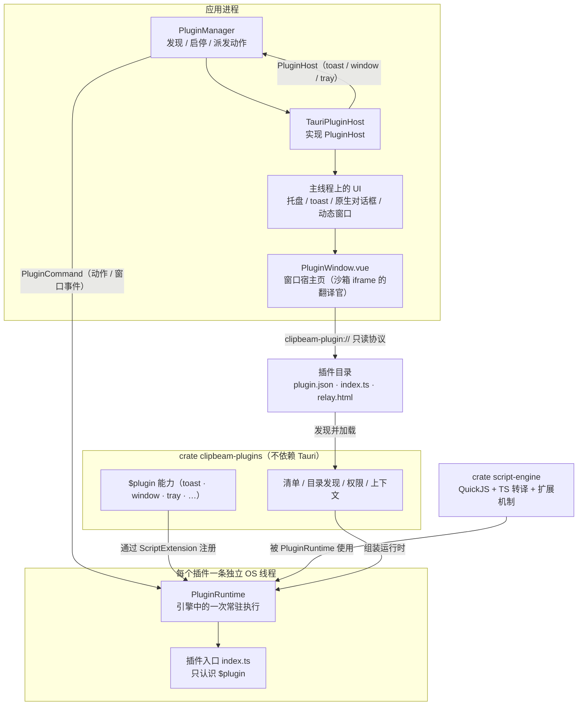
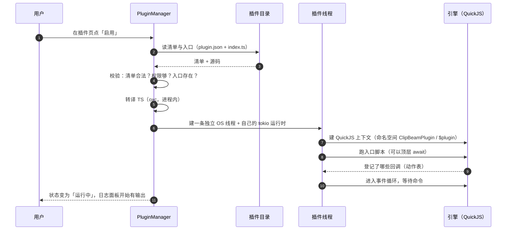
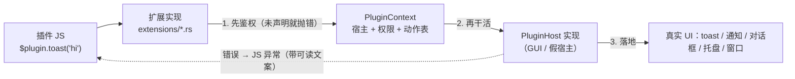
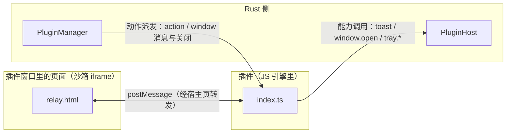
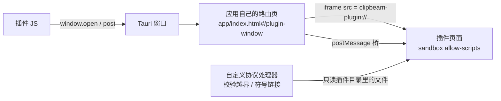
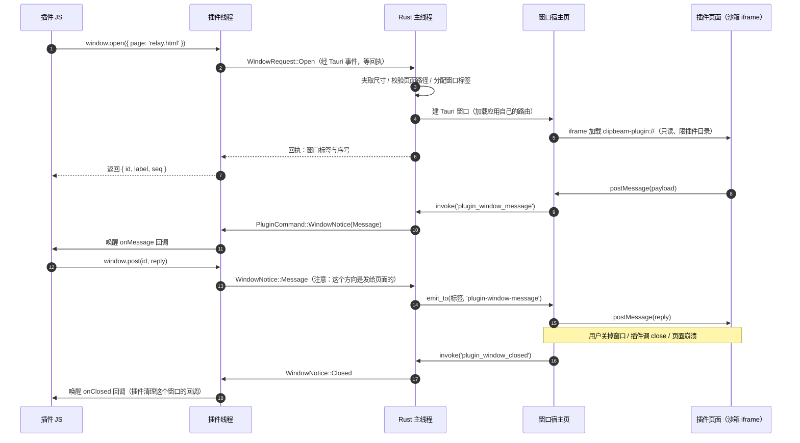
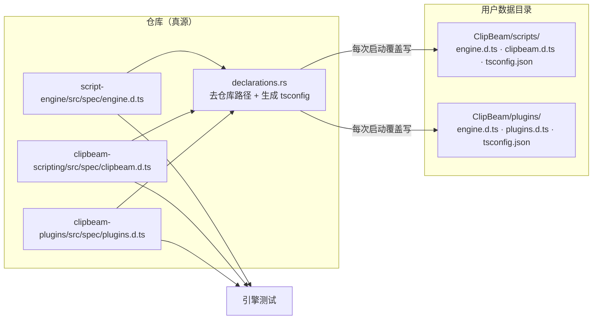

# ClipBeam 插件化：实现步骤、能力规划与使用说明

> 本文是插件体系的**总纲**：现状、设计、路线图、使用说明、待办与不做的事。
> 面向两类读者：想看**原理**的人（§4）、想**写插件**的人（§9）、
> 想知道**为什么编辑器里有提示**的人（§10）、想**继续实现**它的人（§11）。
>
> 阅读约定：本文严格区分三种措辞 ——
> **【已有】** 当前代码库里已经能用的东西；**【本轮】** 已确定方案、尚未实现的插件框架本体；
> **【规划】** 方向明确但方案未定、或刻意推迟到后续轮次的能力。
> 任何标着【本轮】【规划】的功能，**现在都还不能用**。

---

## 1. 一句话定位

ClipBeam 已经具备「跑 JavaScript / TypeScript 并把它接到宿主能力上」的执行内核
（`crates/script-engine`）。插件化要做的事，是在这之上再补一层**常驻扩展机制**：

> 脚本（已有）解决「**这一次**要按几步做完某件事」；
> 插件（本轮）解决「**长期**给应用加一个功能入口」—— 菜单项、快捷键、自己的小窗口、
> 自己的托盘图标，以及在这些入口被触发时执行你自己的 JS。

两者的共同点是「都写 JS」；区别在**生命周期**、**入口归属**和**命名空间**，见 §3.3。

---

## 2. 现状盘点

### 2.1 已经能用的（【已有】）

| 能力                          | 位置                                                 | 说明                                                                                                                             |
| ----------------------------- | ---------------------------------------------------- | -------------------------------------------------------------------------------------------------------------------------------- |
| QuickJS 运行时 + 顶层 `await` | `crates/script-engine/src/runtime.rs`                | `ScriptRuntime` / `RuntimeOptions`，JS 堆上限、栈上限、脚本名、取消信号                                                          |
| TS/TSX → JS 转译              | `crates/script-engine/src/ts.rs`                     | oxc 进程内转译，不依赖 `tsc`；`.js/.mjs/.cjs/.ts/.mts/.cts`                                                                      |
| 标准全局                      | `crates/script-engine/src/prelude.js`                | `sleep`、定时器、`atob`/`btoa`、`performance`、`structuredClone`、`TextDecoder`/`TextEncoder`（全部 WHATWG 编码标签）、`console` |
| 能力扩展机制                  | `crates/script-engine/src/extension.rs`              | `ScriptExtension`（`register` + `spec`）、重名检查、`Object.freeze` 命名空间                                                     |
| 能力命名空间                  | 同上                                                 | 引擎建**匿名**对象，名字由使用方配置；ClipBeam 用 `ClipBeam` / `$`                                                               |
| 控制台落点注入                | `ConsoleHook` + `StdoutConsole` / 前端面板           | GUI 写面板、CLI 写标准流                                                                                                         |
| ClipBeam 能力集               | `crates/clipbeam-scripting`                          | 编解码 / 摘要 / 压缩 / 文件系统 / 宿主交互四大类                                                                                 |
| 脚本目录与内置示例            | `crates/clipbeam-scripting/src/scripts.rs`           | `ensure_seed_scripts`，已存在不覆盖                                                                                              |
| 能力清单 → 前端补全           | `crates/clipbeam-scripting/src/spec.rs`              | spec 是唯一真源，前端拿 JSON 生成 CodeMirror 补全                                                                                |
| 系统通知                      | `src-tauri/src/notify.rs`                            | macOS 通知中心 / Windows Toast；其它平台 no-op                                                                                   |
| 系统原生对话框                | `src-tauri/src/scripting.rs` + `tauri-plugin-dialog` | 确认框、选择框、文件授权框（三按钮自定义）                                                                                       |
| 托盘（固定菜单）              | `src-tauri/src/tray.rs`                              | 菜单项、快捷键 accelerator、忙时禁用、进度环图标、单色 template 适配明暗                                                         |
| 常驻脚本窗口                  | `src-tauri/tauri.conf.json` 的 `scripting` 窗口      | 独立大窗口，侧边栏 + 编辑器 + Console 面板                                                                                       |
| Console 面板后端              | `src-tauri/src/console_panel.rs`                     | 环形缓冲，上限 1000 行，`seq` 递增，清空广播                                                                                     |

### 2.2 缺什么（为什么需要插件化）

1. **没有扩展入口**：想加一个「一键做 X」的动作，只能改 Rust 源码重新编译，用户拿不到。
2. **没有常驻机制**：脚本是「点一次、跑一次」；无法注册一个长期存在的菜单项并在点击时执行。
3. **没有 UI 反馈原语**：脚本侧只有字典式的 `$.type_str`（往别人窗口打字）和系统对话框；
   缺应用内 toast、缺「自己开一个窗口画界面」、缺「自己的托盘图标」。
4. **没有第三方代码的边界**：脚本与宿主能力的接线是硬编码在 `src-tauri/src/lib.rs` 里的，没有「发现 → 声明 → 启停 → 隔离」这套流程。

---

## 3. 设计要点

### 3.1 分层（沿用现有三层结构，不打破它）

| 层           | 位置                                    | 职责                                                                                   | 状态                                                       |
| ------------ | --------------------------------------- | -------------------------------------------------------------------------------------- | ---------------------------------------------------------- |
| 引擎         | `crates/script-engine`                  | 跑 JS/TS、标准全局、扩展机制、命名空间配置。**不含任何业务名字**                       | 【已有】，新增 `eval_global` 与 `register_nested`（§11.2） |
| 脚本能力集   | `crates/clipbeam-scripting`             | 决定脚本侧命名空间叫 `ClipBeam`/`$`；注入编解码/摘要/压缩/文件/宿主交互                | 【已有】                                                   |
| **插件框架** | **`crates/clipbeam-plugins`（新增）**   | 清单解析、目录发现、权限模型、`$plugin` 能力、插件运行时组装。**不依赖 Tauri，可单测** | **【本轮】**                                               |
| 应用接线     | `src-tauri/src/plugin_*.rs`（新增）     | 插件线程管理、发现与启停、UI 落地（toast/通知/对话框/托盘）                            | 【本轮】                                                   |
| 前端         | `src/pages/Plugins.vue`、`ToastHost` 等 | 插件管理页、toast 宿主、浏览器 mock                                                    | 【本轮】                                                   |

**为什么开新 crate 而不塞进 `clipbeam-scripting`**：脚本与插件是两套语义（见 §3.3），
混在一起会让「脚本的宿主接口」被插件需求不断加宽；而 Tauri 相关代码留在 `src-tauri`，
保证 `crates/clipbeam-plugins` 可以用假宿主（FakeHost）完整跑测试 —— 这正是
`crates/clipbeam-scripting/tests/capabilities.rs` 已经在用的手法。

### 3.2 插件长什么样

一个插件 = **一个目录**：

```
<config_dir>/ClipBeam/plugins/
└── hello-plugin/          ← 目录名必须等于 manifest 里的 id
    ├── plugin.json        ← 清单：身份、入口、权限、托盘菜单
    ├── index.ts           ← 入口（也可以写 .js；.ts/.mts/.cts 走 oxc 转译）
    └── index.html         ← 【规划】自定义界面用，本轮不读
```

好处与脚本目录一致：**用户数据不是应用产物**，升级/重装应用不该碰它；用户可以直接
用编辑器改、可以拷给别人、可以用版本管理跟踪。

### 3.3 插件 vs 脚本：为什么是两套，不是一套

| 维度     | 脚本（【已有】）                                                              | 插件（【本轮】）                                 |
| -------- | ----------------------------------------------------------------------------- | ------------------------------------------------ |
| 触发     | 用户在脚本窗口点「运行」                                                      | 托盘菜单 / 事件 / 快捷键（【规划】）             |
| 生命周期 | 跑完即结束，定时器统一清理                                                    | 常驻，直到被禁用或应用退出                       |
| 执行线程 | 任务 Worker 的 `spawn_blocking` 线程                                          | 每个插件**一个独立 OS 线程**（互不干扰）         |
| 命名空间 | `ClipBeam` / `$`                                                              | `ClipBeamPlugin` / `$plugin`                     |
| 宿主接口 | `ScriptHost`：`type_str`（键盘注入）、`confirm`、`pick_path`、`request_focus` | `PluginHost`：toast、系统通知、对话框、托盘      |
| 键盘输出 | 有（含待命窗口、焦点锁定）                                                    | **没有**：插件不该悄悄往别人窗口打字             |
| 失败影响 | 一次运行失败，显示错误                                                        | 只影响该插件自己，列表里标「异常」，其它插件照常 |

命名空间**故意不共用**：插件里出现 `$.type_str` 这种「往当前焦点窗口打字」的语义，
既不符合插件的心智模型，也会把脚本专属的待命窗口逻辑拖进插件运行时。

### 3.4 权限模型：声明 → 拒绝未声明

**插件是可信代码**：它与应用同进程，能读写文件，没有 JS 级沙箱。
`permissions` **不是安全边界**，它的目的是让插件的能力需求可审计、让误用当场暴露：

- 默认**全不开**：`plugin.json` 里不写就是没有；
- 调用未声明的能力 → **当场抛异常**并给出可读文案，而不是静默失败；
- 在启动时校验「声明的能力拿到手」（例如声明了 `menus` 却没开 `tray` 权限 → 启用失败）。

| 权限组          | 覆盖 API                                | 状态     |
| --------------- | --------------------------------------- | -------- |
| `feedback`      | `$plugin.toast`                         | 【本轮】 |
| `notification`  | `$plugin.notify`（系统通知）            | 【本轮】 |
| `system_dialog` | `$plugin.alert` / `$plugin.confirm`     | 【本轮】 |
| `tray`          | `$plugin.tray.*` 与 manifest 的 `menus` | 【本轮】 |
| `window`        | `$plugin.window.*`                      | 【本轮】 |
| `hotkey`        | `$plugin.hotkey.*`                      | 【规划】 |
| `clipboard`     | `$plugin.clipboard.*`                   | 【规划】 |
| `storage`       | `$plugin.storage.*`                     | 【规划】 |

---

---

## 4. 插件机制原理

这一节讲**它是怎么跑起来的**：分几层、启动时发生什么、插件与宿主之间靠什么说话、
一次能力调用经过哪些人。看懂这一节，§6 的 API 与 §7 的限制都是推论。

### 4.1 分层：谁认识谁



三条**单向**依赖是刻意的，也是这套东西能被测试的原因：

| 方向                                 | 含义                                                                              |
| ------------------------------------ | --------------------------------------------------------------------------------- |
| `script-engine` ← `clipbeam-plugins` | 引擎只跑 JS，不认识「插件」这个词；插件层用它的扩展机制注入 `$plugin`             |
| `clipbeam-plugins` ← `src-tauri`     | 插件层不认识 Tauri：UI 由宿主实现 `PluginHost` 提供，于是能力语义可以用假宿主单测 |
| 插件 JS → `$plugin` → 宿主           | 插件**永远拿不到宿主对象**，只能调具体能力（能不能调由权限决定）                  |

### 4.2 启动时序：一次「启用插件」发生了什么



三个细节决定了它的行为：

- **入口只跑一次**。插件不是「每次触发跑一遍脚本」，而是「启动时注册回调，之后被叫醒」；
  生命周期与脚本（跑完即结束）正好相反。
- **取消信号与 UI 通知走同一条队列**（`PluginCommand`），所以停用插件时不会出现
  「界面已经关了、插件还在跑」的错位。
- **校验在起线程之前**，所以「清单写错」不会变成一条难懂的 JS 报错。

### 4.3 一次能力调用：谁来兜住权限



- 每个能力实现的第一行都是**鉴权**（`require_permission`），所以「没在清单里声明」不会走到宿主；
- 宿主错误统一翻译成 JS 异常（[`PluginError::message`](crates/clipbeam-plugins/src/error.rs)），
  插件用 `try/catch` 能拿到「该往清单里加哪一项」这种可执行的信息；
- 这套流程**不需要 Tauri**：`tests/capabilities.rs` 用假宿主把每条语义都跑了一遍。

### 4.4 插件与宿主之间的三条通道

这是整套机制里最容易混的地方 —— 三种「跨边界」各有各的方向和用途：

| 通道     | 方向        | 载体                                    | 用途                                |
| -------- | ----------- | --------------------------------------- | ----------------------------------- |
| 能力调用 | 插件 → 宿主 | `PluginHost` 的方法（同步、可等回执）   | toast / 通知 / 对话框 / 托盘 / 开窗 |
| 动作派发 | 宿主 → 插件 | `PluginCommand::Action` + `eval_global` | 托盘菜单点击、窗口消息与关闭        |
| 窗口数据 | 双向        | Tauri 事件 + `postMessage`              | 插件与它自己窗口里页面之间的数据    |



关键点：**能力调用是同步的、可以等回执**（宿主把结果返回给插件），
而**动作派发是单向的**（宿主把事件塞进队列，插件在自己的线程上处理）。
所以「点一次托盘菜单」不会阻塞界面，而「开一个窗口」能在插件里立刻拿到窗口 id。

### 4.5 为何窗口要绕一层沙箱 iframe



窗口里的**不是**插件页面本身，而是应用自己的宿主页 + 一个沙箱 iframe。这一步换来的是：

- 插件页面拿不到 `window.__TAURI_INTERNALS__`，**无法直接调用宿主 IPC**；
- 它只能 `postMessage`，而宿主页是唯一翻译官 —— 「插件能做什么」于是完全由
  `$plugin` 的能力与权限决定；
- 插件资源只能从 `clipbeam-plugin://` 读，路径越界（`..`、绝对路径、符号链接）一律 404。

### 4.6 一次窗口的完整时序（打开 → 对话 → 关闭）



两个容易被忽略、但设计里明确保证的点：

- **`onClosed` 一定会被叫到**（用户关、插件关、页面异常三条路都汇聚到同一处）——
  否则插件会长期持有一批永远不会被调用的回调；
- **关闭是幂等的**：页面 unload 与 Rust 侧主动关窗可能都来一次，重复通知不会出错。

---

## 5. 插件清单 `plugin.json`

```jsonc
{
  // ── 身份（id 必填）────────────────────────────────────────────
  "id": "hello-plugin", // 必须与目录名一致；[A-Za-z0-9._-]{1,64}，不得以 . 开头
  "name": "示例插件", // 缺省 = id（界面上显示）
  "version": "0.1.0", // 缺省 "0.0.0"
  "description": "演示插件框架的最小例子", // 可选
  "author": "ClipBeam", // 可选

  // ── 运行 ──────────────────────────────────────────────────────
  "entry": "index.ts", // 缺省 index.js；写 .ts/.mts/.cts 时必须显式声明（会走 oxc 转译）

  // ── 权限（缺省全部 false）─────────────────────────────────────
  "permissions": {
    "feedback": true, // $plugin.toast
    "notification": true, // $plugin.notify
    "system_dialog": false, // $plugin.alert / $plugin.confirm
    "tray": true // $plugin.tray.* 与下面的 menus
  },

  // ── 托盘动作菜单（可选；需要 tray 权限）───────────────────────
  "menus": [
    { "id": "hello", "label": "打个招呼", "enabled": true },
    { "id": "count", "label": "计数器 +1" }
  ]
}
```

规则：

- **未知字段不报错**（前向兼容）—— 后续版本的字段可以先写进来，老版本忽略。
- **解析失败 / id 非法 / 目录名与 id 不一致 / 入口不存在** → 插件列表里显示一条
  `无效` 记录并带上具体原因，**不会静默跳过**（否则用户只会看到「插件没出现」）。
- `menus[].id` 在插件内唯一；与插件 id 一起构成托盘菜单的事件标识（`plugin:<id>:<action>`）。

---

## 6. 插件 API（`$plugin`）

> §6.1 ~ §6.4 与 §6.6 已实现（反馈、窗口、托盘动作）；§6.5 与 §6.7 仍是**规划**，
> 字段与命名可能调整。

### 6.1 反馈（应用内 toast）【本轮】

```ts
interface ToastOptions {
  level?: 'info' | 'success' | 'warning' | 'error' // 缺省 info，决定配色
  durationMs?: number // 缺省 4000；0 表示不自动消失
}

interface PluginToastApi {
  toast: (message: string, options?: ToastOptions) => void
}
```

- **不阻塞**（fire-and-forget）：返回即继续，不需要 `await`。
- 由宿主界面渲染：主窗口与脚本窗口的右下角堆叠展示，最多同时 5 条。
- 与系统通知的区别：toast 只在本应用窗口里可见；系统通知会进通知中心，用户切到别的应用也能看到。

### 6.2 系统通知【本轮】

```ts
interface PluginNotifyApi {
  notify: (title: string, body?: string) => void
}
```

走已有 `notify.rs`：macOS 通知中心 / Windows Toast；其它平台静默 no-op（这是现有行为，不额外报错）。
需要 `notification` 权限。

### 6.3 原生对话框【本轮】

```ts
interface DialogOptions {
  title?: string
  buttons?: 'ok' | 'okCancel' | { primary: string, secondary?: string, tertiary?: string }
  timeoutMs?: number // 缺省不超时；超时返回 null
}

interface PluginDialogApi {
  /** 只有一个「好」按钮。 */
  alert: (message: string, options?: DialogOptions) => Promise<void>
  /** 主按钮 → true，次按钮 → false，关闭/超时/第三个按钮 → null。 */
  confirm: (message: string, options?: DialogOptions) => Promise<boolean | null>
}
```

- 实现复用脚本侧同一套 `tauri-plugin-dialog` 原生对话框（GUI 观感一致）。
- **超时一定生效**：宿主侧把阻塞对话框放到独立线程 + `recv_timeout`，
  到点返回 `null`，绝不永久占住插件线程。

### 6.4 窗口与自定义界面【本轮】

```ts
interface WindowOptions {
  title?: string
  width?: number
  height?: number
  resizable?: boolean
  alwaysOnTop?: boolean
  decorations?: boolean
  transparent?: boolean
  /** 相对插件目录的页面；缺省 index.html。 */
  page?: string
  center?: boolean
}

interface PluginWindow {
  id: string
  /** 宿主实际使用的窗口标签（诊断用；插件不需要自己拼标签）。 */
  label: string
  seq: number
}

interface PluginWindowApi {
  open: (options?: WindowOptions) => PluginWindow
  /** 把消息发给窗口页面。 */
  post: (windowId: string, message: unknown) => void
  /** 收窗口页面发来的消息。 */
  onMessage: (windowId: string, callback: (message: unknown) => void) => void
  /** 窗口关闭（用户关掉 / 你关掉 / 页面异常）。 */
  onClosed: (windowId: string, callback: () => void) => void
  close: (windowId: string) => void
}
```

要点（与实现一一对应，见 §4.6 的时序图）：

- 窗口是**真的新窗口**（Tauri 动态建），不是主窗口里的一块面板；
- 插件页面放在**沙箱 iframe** 里，因此它**没有**宿主的 IPC —— 只能用 `postMessage` 说话，
  宿主由 [`PluginWindow.vue`](src/pages/PluginWindow.vue) 这一页充当翻译；
- `width` / `height` 只是「愿望」，宿主夹取到 200~8000（[`plugin_window.rs`](src-tauri/src/plugin_window.rs) 的
  `clamp_size`），所以插件建不出把桌面撑爆的窗口；
- `page` 只能是**插件目录内**的相对路径（协议处理器再做一次词法 + 符号链接校验），
  写 `../` 或绝对路径会被拒绝；
- 窗口 id 由**宿主**分配（`w1` / `w2`…）：两个窗口重名会让它们的回调互相覆盖；
- **一个坑**：插件自己的页面文件**别叫 `index.html`**。那是应用自己的入口，`pnpm dev` 下
  经 Vite 会被回退到 SPA（iframe 里会莫名加载整套应用）。示例用 `relay.html`。

#### 插件页面怎么写

页面跑在沙箱 iframe 里，只能用 `postMessage`：

```js
// 页面 → 插件
window.parent.postMessage({ hello: 'world' }, '*')

// 插件 → 页面
window.addEventListener('message', (event) => {
  console.log('插件说：', event.data)
})
```

插件侧对应：

```js
const win = $plugin.window.open({ page: 'relay.html' })
$plugin.window.onMessage(win.id, (message) => {
  $plugin.window.post(win.id, { echo: message }) // 回一条
})
$plugin.window.onClosed(win.id, () => {
  console.log('窗口关了') // 清理这个窗口的回调
})
```

### 6.5 托盘运行时控制【规划】

```ts
interface PluginTrayApi {
  setTooltip: (text: string) => void
  /** 相对插件目录的图标文件；`null` 恢复默认。 */
  setIcon: (path: string | null) => void
  /** macOS 菜单栏文字徽标；`null` 清除。 */
  setBadge: (text: string | null) => void
  /** 已可用，见 §6.6。 */
  onAction: (callback: (action: { id: string }) => void) => void
}
```

### 6.6 动作回调（本轮唯一的"插件被叫醒"入口）

```js
$plugin.tray.onAction((action) => {
  // action.id 对应 plugin.json 里 menus[].id
  $plugin.toast(`点了 ${action.id}`)
})
```

托盘菜单项被点击时，宿主把 `{ id }` 作为 JSON 传给这个回调。
和事件订阅 API（`$plugin.on(event, cb)`）在【本轮】不实现：一个动作回调已经足够跑通
「插件 → 宿主 UI → 插件」的闭环，事件订阅等窗口落地后一起做，避免过早定协议。

### 6.7 其它规划能力（方向）

| 能力                                   | 说明                                                                                             |
| -------------------------------------- | ------------------------------------------------------------------------------------------------ |
| `$plugin.hotkey.register(combo, cb)`   | 插件注册自己的全局快捷键；需要与现有热键系统协调（`src-tauri/src/hotkey.rs` 目前是忙闲两态注册） |
| `$plugin.clipboard.readText/writeText` | 读写剪贴板（宿主已有 clipboard 插件依赖）                                                        |
| `$plugin.storage.get/set`              | 插件自己的键值持久化（落在插件目录，避免污染主配置）                                             |
| `$plugin.on(event, cb)`                | 订阅宿主事件（任务完成、配置变更、其它插件事件）                                                 |
| `$plugin.command(name, cb)`            | 让插件暴露命令，供其它插件或用户脚本调用                                                         |
| `$plugin.window` 之外的富 UI           | 托盘 tooltip/图标/徽标（§6.5）、通知带按钮、进度提示                                             |

---

## 7. 生命周期、错误隔离与限制

### 7.1 状态机

```
发现(Invalid) ──修复清单/目录──> Disabled ──enable 成功──> Active
                                   ▲                          │
                                   │                          ├─ 入口抛错 ──> Error
                                   └────---disable---─────────┤
                                                              └─ 动作 5s 未返回 ──> Stuck
```

- **发现 ≠ 启用**：默认全部关闭，用户在插件页手动打开（示例插件同样默认关闭）。
- 启用 = 起一个独立线程 → 建插件运行时 → 跑入口 → 进入事件循环。
- 禁用 = 发停止信号 → 等线程退出（超时即标「停止超时」）→ 拆掉它的托盘项与日志。
- 「重新加载」= 禁用 + 启用；【本轮】不做文件热重载（改完代码点一下按钮即可）。

### 7.2 错误隔离

| 故障           | 表现                                                                                         |
| -------------- | -------------------------------------------------------------------------------------------- |
| 入口抛异常     | 该插件标「异常」，错误原文进列表与插件日志；其它插件不受影响                                 |
| 动作回调抛异常 | 记录到插件日志，托盘菜单保持可用                                                             |
| 插件死循环     | **只卡住它自己的线程**；应用与其它插件正常；该插件之后的动作被直接拒绝并提示「插件疑似卡住」 |
| 插件线程 panic | 线程收尾时标「异常」，把 panic 文案写进列表                                                  |

### 7.3 已知限制（写清楚，避免误解）

- **无沙箱**：插件能读写文件、能调用宿主能力（在权限声明范围内）。只装你信任的插件。
- **中断是协作式的**：引擎的取消信号只在 JS 让出执行权（`await`、定时器）时生效，
  一个纯计算的死循环无法被强行打断（QuickJS 无执行步数预算）。
- **无热重载**：【本轮】改插件代码需要点「重新加载」。
- **无常驻定时器**：引擎每次求值结束后会清理定时器，所以「常驻后台自己跑」用事件驱动，
  不用 `setInterval`（后续若要支持，需要在引擎层引入常驻定时器语义）。
- **单实例**：同一插件同时只能启用一次；【规划】允许一个插件开多个窗口（同一个进程）。
- **无依赖管理**：插件不能 `import` 其它插件或第三方 npm 包（【规划】里有讨论，未定方案）。

---

## 8. 用户界面与交互（【本轮】设计）

- **插件管理页**（主窗口侧边栏「插件」，新路由 `/plugins`）：
  列表（名称 / 版本 / 状态徽章 / 权限标签 / 最近错误）+ 开关 + 「重新加载」+「打开插件目录」+「刷新」；
  底部是该插件的日志面板（复用脚本 Console 的等级着色与自动跟随）。
- **toast 宿主**：主窗口与脚本窗口右下角渲染；`progress` / `standby` 两个裸窗不渲染（它们是浮动小窗）。
- **托盘**：主菜单里追加「插件」子菜单，按插件分组、按 `menus` 顺序排列；
  启用/禁用/重载会重建托盘菜单（避免 macOS/Windows 上菜单项增删的平台差异）。
- **浏览器调试**：插件页与 toast 在 `pnpm dev` + Chrome 下要用 mock 走通（`src/dev/mock/`），
  真机才验的能力（真实托盘、原生对话框、系统通知）在文档里标出来。

---

## 9. 使用说明

### 9.1 给使用者：怎么装、怎么开、插件放哪

1. 打开**插件目录**：主窗口 → 侧边栏「插件」→ 「打开插件目录」（或手动进入下表路径）；
2. 把插件目录整个拷进 `plugins/`（每个插件一个子目录，里面必须有 `plugin.json`）；
3. 回到插件页点「刷新」，列表出现该插件（默认**关闭**状态）；
4. 打开开关 → 启用成功即可在托盘菜单看到它的入口；
5. 插件报错时列表会显示错误原文；点「重新加载」可重试；点「打开插件目录」可直接改代码。

| 平台    | 插件目录                                          |
| ------- | ------------------------------------------------- |
| macOS   | `~/Library/Application Support/ClipBeam/plugins/` |
| Windows | `%APPDATA%\ClipBeam\plugins\`                     |
| Linux   | `~/.config/ClipBeam/plugins/`                     |

> 与脚本目录（`.../ClipBeam/scripts/`）同级，同样属于**用户数据**：升级或重装应用不会覆盖，
> 也不该提交进应用仓库。

### 9.2 给插件作者：最小可用插件（【本轮】目标形态）

目录 `plugins/hello-plugin/`（示例里三个文件：清单 + 入口 + 窗口页面）：

`plugin.json`

```json
{
  "id": "hello-plugin",
  "name": "示例插件",
  "version": "0.1.0",
  "description": "演示插件框架的最小例子",
  "entry": "index.ts",
  "permissions": { "feedback": true, "notification": true, "tray": true, "window": true },
  "menus": [
    { "id": "hello", "label": "打个招呼" }
  ]
}
```

`index.ts`

```js
// index.ts —— 入口在插件启用时执行一次。允许顶层 await。
// $plugin 是插件能力命名空间（正式名 ClipBeamPlugin）。
console.log('hello-plugin 已启用')

// 注册托盘菜单动作：menus[].id → 这里收到的 action.id
$plugin.tray.onAction(async (action) => {
  if (action.id === 'hello') {
    $plugin.toast('你好，我是插件 👋', { level: 'success' })
    $plugin.notify('ClipBeam 插件', '来自 hello-plugin 的通知')
  }
})

// 对话框可以 await 拿结果（关闭/超时是 null）
// const ok = await $plugin.confirm('要继续吗？')
// if (ok === true) $plugin.toast('你选了「是」')

// 也可以开一个自己的窗口（页面放在插件目录里）
const win = $plugin.window.open({ title: '我的面板', width: 420, page: 'panel.html' })
$plugin.window.onMessage(win.id, (message) => {
  console.log('页面说：', message)
  $plugin.window.post(win.id, { ok: true })
})
$plugin.window.onClosed(win.id, () => console.log('窗口关了'))
```

> 开窗要求 `plugin.json` 里有 `"window": true`，并且插件目录里真的有 `panel.html`
> （页面跑在沙箱 iframe 里，只能用 `postMessage` 与插件通信，见 §6.4）。

类型提示来自 `crates/clipbeam-plugins/src/spec/plugins.d.ts`（随框架一起提供），
所以插件入口写 `.ts` 时 `$plugin` / `ClipBeamPlugin` 是有类型的 —— 前提是这个文件落在
`crates/tsconfig.json` 的 include 里（见 §9.3 的排错条目）。

### 9.3 调试建议

- **先用 console**：插件日志在插件页底部，`console.log/info/warn/error` 都收得到；
- **权限报错就是接线问题**：`未声明 xxx 权限` 说明 `plugin.json` 里少写了一个开关；
- **入口报错看状态**：列表状态为「异常」时，错误原文（含文件名与行列）在列表里；
- **改完记得「重新加载」**：【本轮】没有热重载。

#### 编辑器报「找不到名称 `$plugin`」（运行期其实是好的）

这是**类型层面**的问题，不是插件跑不起来。原因与修法：

1. `$plugin` / `ClipBeamPlugin` 是**全局声明**（`declare const $plugin`，在
   `crates/clipbeam-plugins/src/spec/plugins.d.ts` 里）。声明文件只有落进某个 tsconfig 的
   `include`，编辑器才看得见它 —— 否则会回退到「推断项目（inferred project）」，那里没有
   这份声明，于是所有 `$plugin.xxx` 都报 `TS2304: Cannot find name '$plugin'`。
2. 仓库里负责这件事的是 `crates/tsconfig.json`，它的 include 必须是**递归**的：

   ```jsonc
   { "include": ["*/src/spec/*.d.ts", "*/seed/**/*.ts"] }
   ```

   **不能**写成 `*/seed/*.ts`：插件示例是「一个插件一个目录」，入口在
   `seed/<插件 id>/index.ts`，比脚本示例（`seed/02-ts-demo.ts`，正好一层）深一层，
   写成单层通配对插件示例**不生效**。

3. 自查命令（应当无输出、退出码 0）：

   ```bash
   pnpm typecheck:examples   # 就是 tsc -p crates/tsconfig.json
   ```

   > 注意 tsconfig 的 `include` 是**相对该 tsconfig 所在目录**解析的，所以这条命令里的
   > 路径模式是 `*/seed/**/*.ts`（相对 `crates/`），不要照抄到仓库根目录的 tsconfig 里。

4. **在插件目录里写 `.ts` 不需要你做任何配置**：应用启动时会把
   `engine.d.ts` / `plugins.d.ts` / `tsconfig.json` 写进插件目录，
   编辑器打开那个目录就有提示（细节见 §10）。
   如果**没有**提示，先确认那三个文件在不在（重新启动一次应用会刷新）。

#### 换了入口扩展名（`index.js` → `index.ts`）之后要同步什么

`plugin.json` 的 `"entry"` **必须跟着改**。缺省值是 `index.js`，改成 `.ts` 就得显式声明：

```jsonc
{ "entry": "index.ts" }
```

漏改的表现是「启用插件」时报
`读取插件入口 …/index.js 失败：No such file or directory`（发现阶段还会把「找不到入口文件」
标在这张卡片的错误行上）。已经释放过旧示例的机器上，旧的 `index.js` **不会被自动删除**
（那是用户数据目录，应用不删用户的文件）—— 手工删掉它，或者整个删掉那个插件目录再重启，
让内置示例重新释放。

---

## 10. 类型支持（编辑器里的提示）

用户是在**自己的数据目录**里写脚本与插件的，那里不会有这个仓库。所以类型提示要靠应用
把它们需要的声明**写进那个目录**。

### 10.1 应用写了什么

每次启动（GUI 的 setup、CLI 运行脚本前）都会刷新这六个文件：

| 目录                           | 文件            | 作用                                                                                   |
| ------------------------------ | --------------- | -------------------------------------------------------------------------------------- |
| `<配置目录>/ClipBeam/scripts/` | `engine.d.ts`   | 引擎的标准全局：`sleep` / `console` / `TextDecoder` / 定时器 / `atob` / `performance`… |
|                                | `clipbeam.d.ts` | `ClipBeam` / `$` 的能力声明（编码、摘要、压缩、文件系统、宿主交互）                    |
|                                | `tsconfig.json` | 编辑器项目配置                                                                         |
| `<配置目录>/ClipBeam/plugins/` | `engine.d.ts`   | 同上（插件入口也用得到这些全局）                                                       |
|                                | `plugins.d.ts`  | `$plugin` / `ClipBeamPlugin` 的能力声明                                                |
|                                | `tsconfig.json` | 同上                                                                                   |



### 10.2 为什么要连 `tsconfig.json` 一起写

这一步不是可选的，两个真实问题实测复现过：

1. **只有声明文件也不够，编辑器可能认不出**：`$plugin` / `$` 是**全局**声明，
   只有落进某个「项目」（tsconfig 的 include，或目录级项目的推断）才会被收进来。
   给一份 `tsconfig.json` 就能把它变成确定行为，而不是碰运气。
2. **不关掉 DOM 会撞名**：TypeScript 默认按浏览器环境检查（`lib.dom.d.ts`），
   而脚本/插件跑在 QuickJS 里**没有 DOM**。不关掉就会报一堆
   `Duplicate identifier 'TextDecoder'` / `Cannot redeclare block-scoped variable 'console'`。

所以那份生成的 `tsconfig.json` 有两个关键设置：`lib: ["ESNext"]`（不含 DOM）与 `types: []`
（不拉 `@types/node`），`include` 是 `["*.ts", "*.d.ts"]`。

### 10.3 它是「产物」，不是「用户数据」

|      | 示例脚本 / 示例插件                        | 类型声明与 tsconfig                                  |
| ---- | ------------------------------------------ | ---------------------------------------------------- |
| 策略 | **已存在就不覆盖**（用户改过的示例要保留） | **每次启动覆盖**                                     |
| 理由 | 它们是拿来改的起点                         | 它们是这份二进制对外的**类型契约**，必须与运行期一致 |

也就是说：改 `engine.d.ts` / `plugins.d.ts` / `tsconfig.json` 没有意义（下次启动会被还原），
要改类型就改仓库里的源文件。

### 10.4 在插件目录里写 `.ts` 的效果

放进 `<配置目录>/ClipBeam/plugins/<你的插件>/index.ts`，编辑器（VS Code / WebStorm）打开
那个目录即可获得：

- `$plugin.*` 的补全与参数提示（含 `tray` / `window` 子对象）；
- `console` / `sleep` / `TextDecoder` 等全局的类型；
- **写错就报红**（例如 `level: 'warn'` 会被指出应为 `'warning'`）。

这两点都有测试钉住：`clipbeam-plugins` 与 `clipbeam-scripting` 的 `declarations.rs` 里
各有一条测试会把生成的声明放进临时目录、**调用真正的 `tsc`** 检查「正常代码通过 + 写错报错」，
插件那条还额外验证**内置示例本身**能通过（用户照抄示例不会撞类型错误）。

> 没有安装 `pnpm`/`tsc` 的环境会跳过这两条（打印一行提示），仓库侧另有
> `pnpm typecheck:examples` 兜住。

---

## 11. 实现步骤（路线图）

### 11.1 分批实施（每批可独立验证）

| 批次                   | 内容                                                                                                                                                                                                                                        | 验证方式                                                                                                         |
| ---------------------- | ------------------------------------------------------------------------------------------------------------------------------------------------------------------------------------------------------------------------------------------- | ---------------------------------------------------------------------------------------------------------------- |
| **B0 基线**            | `tar` 快照到 `/tmp`（含未跟踪文件）+ 记录 HEAD                                                                                                                                                                                              | 快照文件存在、`git status` 干净                                                                                  |
| **B1 引擎小改**        | `ScriptRuntime::eval_global(name, payload)`：按名字调一个已注册的全局函数，payload 走 JSON，返回完成值                                                                                                                                      | `cargo test -p script-engine`（含 ok / 不存在 / 非函数 / async / 抛错 / 返回 null 六种情形）                     |
| **B2 插件 crate 骨架** | `crates/clipbeam-plugins`：`manifest` / `id` / `catalog` / `permission` / `host` / `context` / `runtime`                                                                                                                                    | `cargo test -p clipbeam-plugins`（清单解析、id 规则、目录扫描、非法项、seed 不覆盖）                             |
| **B3 能力与示例**      | `extensions/feedback.rs`、`extensions/tray.rs`、`spec/plugins.d.ts`、`seed/01-hello-plugin/`                                                                                                                                                | `tests/capabilities.rs` 用 FakePluginHost 覆盖四个能力 + 权限拒绝 + 未声明报错；`spec_sync` 校验声明与运行期一致 |
| **B4 应用接线**        | `plugin_manager.rs`（线程/状态/日志）、`plugin_host.rs`（toast/通知/对话框/托盘）、`plugin_window.rs`（路径安全校验 + 窗口参数夹取；窗口那一轮再落协议与建窗）、`plugin_commands.rs`（5 条命令）、`tray.rs` 子菜单、`lib.rs` 注册与退出收尾 | `cargo test -p clipbeam`；真机手测 §11.3                                                                         |
| **B5 前端**            | `Plugins.vue`、toast 宿主组件、路由与侧边栏、mock 夹具                                                                                                                                                                                      | `pnpm lint` / `pnpm build`；浏览器 mock 下页面可用                                                               |
| **B6 文档与 CI**       | README 增「插件框架」章节、workspace members、`ci.yml` 的 `rust-crates` job 补 `-p clipbeam-plugins`、`tsconfig.scripts.json` include 插件声明文件                                                                                          | CI 配置语法与本地同命令跑通                                                                                      |
| **B8 窗口那一轮**      | `plugin_window.rs` 落窗口参数夹取 + 协议处理器；`plugin_host.rs` 加窗口请求与登记表；前端 `PluginWindow.vue` relay + `clipbeam-plugin://` 协议；示例插件加「打开演示窗口」（`relay.html`）                                                  | `cargo test -p clipbeam`（登记表/夹取/协议路径/URL 编码）+ §10.3 的窗口验收项                                    |
| **B9 全量验证**        | 见 §11.4                                                                                                                                                                                                                                    | 全绿 + §11.3 手测通过                                                                                            |

### 11.2 与既有代码的接触面（尽量小）

- `crates/script-engine/src/runtime.rs`：新增 `eval_global`（通用方法，不含插件语义）；
- `src-tauri/src/lib.rs`：注册 State 与 5 条命令、托盘事件分流、退出时停全部插件、
  让插件窗口绕开「关闭即隐藏」；
- `src-tauri/src/tray.rs`：把现有 `build` 里的菜单组装抽成 `build_menu(app, cfg, plugin_items)`，
  新增 `sync_plugin_menus` 与菜单 id 的拼装/解析纯函数；
- `src-tauri/src/commands.rs`：不改既有命令，新命令放独立文件；
- `Cargo.toml`（workspace）、`.github/workflows/ci.yml`、`tsconfig.scripts.json`、`README.md`；
  类型支持新增 `crates/*/src/declarations.rs` 与 `crates/script-engine/src/portable.rs`。

其余都是**新增文件**，回退 = 还原这 4 个文件 + 删除新目录/新 crate。

### 11.3 手工验收清单（自动化测不到的部分）

1. 拷入示例插件 → 插件页「刷新」→ 列表出现、状态「已关闭」；
2. 打开开关 → 托盘菜单出现「插件 → 示例插件 → 打个招呼」；
3. 点该项 → 右下角 toast 出现、系统通知出现（macOS/Windows）；
4. 把 `permissions.feedback` 改成 `false` → 重新加载 → 点菜单 → 列表/日志出现权限报错，应用不崩；
5. 故意把入口写成 `throw new Error('boom')` → 列表标「异常」并显示 `boom`；
6. 关掉插件 → 托盘项消失；**禁用时打开着的窗口一起被销毁**；
7. 退出应用 → 托盘子菜单不残留；
8. 用一个死循环插件试一次 → 应用仍可操作，其它插件照常，该插件后续动作被拒绝。

窗口这一轮新增的验收项（同样只能真机手测）：

9. 点「打开演示窗口」→ 出现一个 420×320 的独立窗口，标题是「hello-plugin 面板」；
10. 窗口里的页面显示「页面已就绪」→ 说明 **页面 → 插件** 通了（插件日志里能看到
    `页面发来：{"from":"page",...}`）；
11. 在页面输入框里打字并回车 → 页面出现 `← 插件：{...}` → 说明 **插件 → 页面** 也通了（双向闭环）；
12. 手动关掉那个窗口 → 插件日志出现「窗口已关闭，清理它的回调」，toast 提示「演示窗口已关闭」；
13. 插件里把 `page` 改成 `../../etc/passwd` → 开窗失败并给出「不能包含 ..」的参数错误；
14. 插件里把 `width` 改成 `100000` → 窗口被夹到 8000（不会把桌面撑爆）；
15. 插件**没有**声明 `window` 权限时点该菜单项 → 报「未声明 window 权限」，而不是窗口莫名不出现。

### 11.4 验证命令

```bash
# Rust
cargo fmt --all --check
cargo test -p script-engine -p clipbeam-scripting -p clipbeam-plugins
cargo clippy -p script-engine -p clipbeam-scripting -p clipbeam-plugins --all-targets -- -D warnings
cargo test -p clipbeam            # Tauri 侧（需要本机图形栈）

# 前端
pnpm lint
pnpm typecheck:scripts            # 含插件 .d.ts
pnpm test:editor
pnpm build
```

### 11.5 交付后待决策的事项与已补的修复

**零、示例插件入口改成 `.ts` 之后补的一处配置修复（已完成）。**

`crates/tsconfig.json` 的 include 原本是 `*/seed/*.ts`，匹配不到
`seed/<插件 id>/index.ts`（深一层），于是编辑器对插件入口回退到 inferred project、
报「找不到名称 `$plugin`」。已改为 `*/seed/**/*.ts`，并把 `pnpm typecheck:examples`
（= `tsc -p crates/tsconfig.json`）加进 CI 前端 job 与 `scripts/release.sh` 的门禁；
`crates/clipbeam-plugins/seed/hello-plugin/index.js`（换扩展名后的残留）已删除，
`seed.rs` 的测试补了一条「释放结果不该出现 `index.js`」的断言。排错步骤见 §9.3。

**一、`pack_and_shard` 的红测已解决（口径：承认填充）。**

交付时 `crates/clipbeam-scripting/tests/capabilities.rs` 的
`pack_and_shard_seed_script_runs_end_to_end` 是红的：它断言「敲给远端的还原脚本负载只含
base32 小写**无填充**字符」，而 seed 的 `03-pack-and-shard.ts` 用的是 `$.base32_lower`
（**带** `=` 填充）。现已按「承认填充」的口径把测试改对（接受 `=`，并用
`data_encoding::BASE32` 而非 `BASE32_NOPAD` 解码）。

> 遗留一处**文档口径不一致**（本次未改，因为不在批准范围内）：`03-pack-and-shard.ts`
> 的头部注释与 §9.2 的说明仍写着「base32 小写无填充、密文里不会出现 `=`」，
> 与它实际调用 `$.base32_lower` 的事实不符。要么把脚本改成 `base32_lower_nopad`、
> 要么把注释改成「带填充」，两者取一即可。

**二、`ScriptExtension` 新增了 `register_nested`，导致「扩展数量」断言 15 → 16。**

引擎的 `ScriptExtension` trait 为了支持嵌套能力（`$plugin.tray.onAction`）新增了一个
默认方法 `register_nested`，于是 `clipbeam-scripting` 三处统计扩展数量的断言需要 +1。
这三处已一并更新（`capabilities.rs` 两处、`text_codec.rs` 一处），属于本次改动的连带影响，
在此明示。

---

## 12. 未来能力规划（Backlog）

按「先做能验证框架的、再做锦上添花的」排序。P0 = 框架跑通必需；P1 = 明确下一步；
P2 = 有价值但优先级待定。

| 优先级        | 能力                              | 说明                                    | 依赖                           |
| ------------- | --------------------------------- | --------------------------------------- | ------------------------------ |
| P0            | 清单 + 发现 + 启停 + 权限         | 框架本体                                | —                              |
| P0            | toast / 系统通知 / 原生对话框     | 反馈机制                                | —                              |
| P0            | 托盘动作菜单 + 动作回调           | 插件被触发的入口                        | —                              |
| ~~P0~~ 已完成 | 自定义 HTML 窗口（§6.4）          | 应用内新窗口 + 自定义协议 + iframe 沙箱 | —                              |
| P1            | 插件页日志与错误可见性增强        | 过滤、导出、一键复制错误                | —                              |
| P1            | `$plugin.tray` 运行时控制（§6.5） | tooltip / 图标 / 徽标                   | U1 图标资源路径规则            |
| P1            | 事件订阅 `$plugin.on(event, cb)`  | 任务完成、配置变更                      | 事件协议定稿                   |
| P1            | 插件窗口增强                      | `win.setTitle` / 位置记忆 / 多页面导航  | —                              |
| P2            | 插件快捷键                        | 与现有忙闲两态热键协调                  | `src-tauri/src/hotkey.rs` 改造 |
| P2            | 剪贴板读写                        | 宿主已有 clipboard 依赖                 | 权限组                         |
| P2            | 插件私有存储                      | 插件目录内键值文件                      | —                              |
| P2            | 插件暴露命令 `$plugin.command`    | 插件互调 / 脚本调用插件                 | 命名空间与冲突规则             |
| P2            | 示例插件集                        | 每个能力一个最小示例                    | 各能力落地                     |
| P3            | 安装/卸载/更新（含目录拖拽）      | 需要签名与来源信任模型                  | 安全模型设计                   |
| P3            | 插件市场 / 索引                   | 需要分发渠道                            | 安装机制                       |
| P3            | 插件依赖声明                      | 插件之间依赖与加载顺序                  | 命名空间设计                   |
| P3            | 常驻定时器 / 后台任务             | 引擎需引入常驻定时器语义                | 引擎改造                       |
| P3            | 每插件资源配额                    | 内存/CPU/文件句柄上限                   | 引擎与线程模型                 |

---

## 13. 明确不做（含理由）

| 不做                                | 理由                                                                                                              |
| ----------------------------------- | ----------------------------------------------------------------------------------------------------------------- |
| JS 级沙箱（隔离文件/网络）          | QuickJS 进程内运行，做真隔离要换执行模型（子进程/WASM），成本远大于收益；改为「可信代码 + 声明式权限 + 错误隔离」 |
| 给脚本加插件专属 API                | 脚本是「跑一次」，插件是「常驻」，混用会把两套生命周期语义搅在一起；脚本继续用已有的 `$.confirm` 与系统通知       |
| 插件里做键盘注入（`type_str` 那套） | 键盘注入有焦点风险，必须走待命窗口确认；插件常驻、可能在后台被触发，不适合这条链路                                |
| 依赖 npm 生态                       | 插件运行在 QuickJS 里，没有 Node 的模块解析与文件系统 API；引入打包器是另一个量级的工作                           |
| 插件改 ClipBeam 固定菜单            | 托盘主菜单是应用自己的功能面，插件只能在自己的子菜单里加项，避免两个插件争抢同一位置                              |

---

## 14. 风险与对策

| 风险                             | 对策                                                                                                                |
| -------------------------------- | ------------------------------------------------------------------------------------------------------------------- |
| 插件死循环拖住自己的线程         | 独立线程隔离；动作超时判定为「卡住」并拒绝新动作；文档明确「无强制打断」                                            |
| 托盘菜单重建引发平台差异         | 抽成「整菜单重建」一条路径，不在菜单项粒度做增删；纯函数（id 拼装/解析）单测覆盖                                    |
| 插件线程调用 UI API 时压住主线程 | 用事件 + `listen_any` 把托盘操作送回主线程执行，结果经 oneshot 回来；**不阻塞主线程**；纯函数与宿主接口分离，可单测 |
| 对话框永久阻塞插件               | 宿主侧独立线程 + `recv_timeout`，超时返回 `null`                                                                    |
| 权限模型被误解为安全边界         | 文档、插件页与错误文案三处都写明「可信代码」                                                                        |
| 声明文件与运行期漂移             | 与现有 `spec_sync` 同款测试：手写 `.d.ts` 的名字必须在运行期存在                                                    |
| 能力清单/文档不同步              | spec 是唯一真源（前端补全、README 能力表、`.d.ts` 三处由测试钉住）                                                  |

---

## 15. 术语与文件索引

| 术语               | 含义                                                                            |
| ------------------ | ------------------------------------------------------------------------------- |
| 引擎 / core        | `crates/script-engine`：只跑 JS，不含业务名字                                   |
| 能力（capability） | 挂在命名空间上的一个 JS 函数，由 `ScriptExtension` 注册并声明 `spec`            |
| 命名空间           | `ClipBeam` / `$`（脚本）与 `ClipBeamPlugin` / `$plugin`（插件）                 |
| 清单 / manifest    | 插件目录里的 `plugin.json`                                                      |
| 动作 / action      | `menus[].id` 标识的一个托盘菜单项；点击时唤醒插件的回调                         |
| 宿主 / host        | 实现 `ScriptHost`（脚本）或 `PluginHost`（插件）的那一侧；GUI 与 CLI 是两种实现 |
| 权限组             | manifest 里 `permissions` 的一个开关，对应一组 API                              |

| 相关文件                                                | 作用                                                    |
| ------------------------------------------------------- | ------------------------------------------------------- |
| `crates/script-engine/`                                 | 执行内核与扩展机制                                      |
| `crates/script-engine/src/spec/engine.d.ts`             | 引擎标准全局的类型声明                                  |
| `crates/clipbeam-scripting/`                            | 脚本能力集（现有四大类能力与 `ScriptHost`）             |
| `crates/clipbeam-scripting/src/spec/clipbeam.d.ts`      | 脚本能力 `$` 的类型声明                                 |
| `crates/clipbeam-plugins/`【本轮】                      | 插件框架：清单、发现、权限、`$plugin` 能力、运行时组装  |
| `crates/clipbeam-plugins/src/spec/plugins.d.ts`【本轮】 | 插件能力 `$plugin` 的类型声明                           |
| `src-tauri/src/tray.rs`                                 | 托盘菜单（含插件子菜单）                                |
| `src-tauri/src/notify.rs`                               | 系统通知                                                |
| `src-tauri/src/console_panel.rs`                        | 日志环形缓冲（脚本与插件共用形态）                      |
| `src-tauri/src/scripting.rs`                            | 脚本宿主实现（`PluginHost` 的实现可参考它的对话框用法） |
| `src/pages/Plugins.vue`【本轮】                         | 插件管理页                                              |
| `README.md`                                             | 面向使用者的总说明（插件章节从本文提炼）                |
| `.trae/documents/clipbeam_plan.md`                      | 项目最初的整体实现计划（历史资料）                      |
